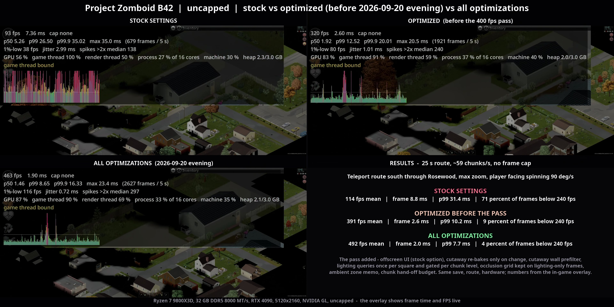
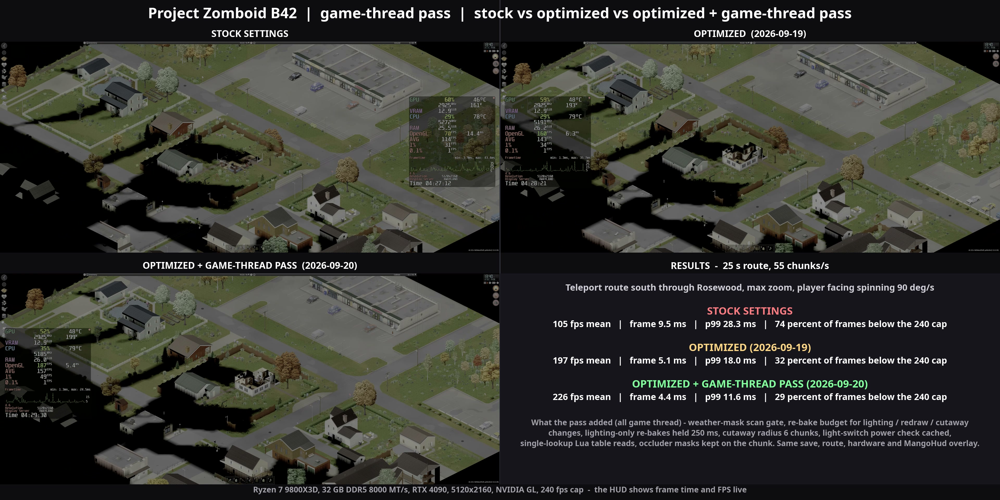
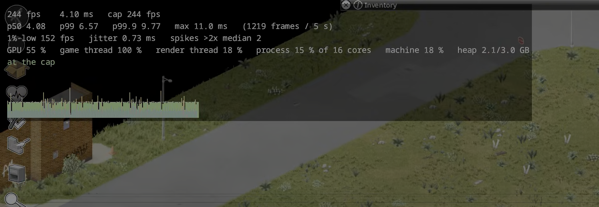

# PZ_Optimization

Performance patches for **Project Zomboid Build 42**, on the Java side of the game.
Not a Lua mod: a set of drop-in `.class` files that shadow 28 game classes and remove
the worst stalls from the chunk streamer, the renderer and the loading path.
`projectzomboid.jar` is never modified. Every change has a kill switch, and every
number in this file comes from the hands-off benchmark harness in this repo.

**Target: Build 42.20.4, jar revision `b0bbce05d5`, Windows and Linux.** Both Steam
depots ship the same jar. The overrides refuse to run against any other revision:
they log one line and the game behaves as stock.

Single-player only. Read [Known limitations](#known-limitations) before installing on
a machine you play on.

> **Important: turn off Steam's in-game performance monitor.** The newer FPS /
> performance overlay in Steam's settings (Settings > In Game > "In-game
> performance monitor"), not the classic Shift+Tab overlay, hooks every GL call
> and serialises the render thread. With it on, the optimized game stops at
> roughly 160 fps and the render thread sits at 90 % of a core, so the headroom
> these patches recover is hidden. The classic Steam overlay is harmless. Stock is
> GPU-bound at max zoom either way, so the monitor only hides the difference; it
> does not change the stock numbers. Every result below and every harness run was
> taken with it off (A/B/A on the 120 km/h route: 164 fps with it on, 237 fps off;
> see `docs/results.md`, 2026-09-19). Use the build's own performance overlay
> (F9, see [Performance overlay](#performance-overlay)), MangoHud or RivaTuner instead.

---

## Contents

1. [Results at a glance](#results-at-a-glance)
2. [Install on Windows](#install-on-windows)
3. [Install on Linux](#install-on-linux)
4. [Settings](#settings) ([in the game menu](#in-the-game-menu), [performance overlay](#performance-overlay), [in a file](#in-a-file))
5. [Uninstall](#uninstall)
6. [After a game update](#after-a-game-update)
7. [How the optimizations work](#how-the-optimizations-work)
8. [Roadmap](#roadmap)
9. [How the install works without touching the jar](#how-the-install-works-without-touching-the-jar)
10. [Known limitations](#known-limitations)
11. [Benchmark harness](#benchmark-harness)
12. [Repository layout](#repository-layout)

---

## Results at a glance

All runs: same save, same car, same 1,200-tile highway route east of Rosewood, max
zoom, 5120x2160. Machine: Ryzen 7 9800X3D, RTX 4090, Crucial T705 NVMe, 32 GB DDR5.
"Stock" is this build with every optimization switched off, which reproduces the
shipped game exactly.

### Rosewood uncapped: stock vs optimized vs all optimizations (2026-09-20 evening)

The same spinning Rosewood route with the frame cap off, recorded with the build's own
performance overlay on screen (no MangoHud). Three recordings: stock settings, the
optimized build as it was before the evening pass, and the build with everything
including the pass (`harness/stitch-triple-hdr.sh`, runs `u400show-stock-2`,
`u400show-prev-1`, `u400show-all-1`; AV1 10-bit HDR, the click-through copy is a
1920x960 encode of the same file).

[](docs/media/rosewood-spin-uncapped-stock-vs-optimized-vs-all-hdr-1080.mp4)

| Metric | Stock settings | Optimized (before the pass) | All optimizations |
|---|---|---|---|
| fps, mean | 114 | 391 | 492 |
| Frame time, mean | 8.8 ms | 2.6 ms | 2.0 ms |
| Frame time, p50 | 6.2 ms | 1.9 ms | 1.6 ms |
| Frame time, p90 | 17.8 ms | 4.4 ms | 3.3 ms |
| Frame time, p99 | 31.4 ms | 10.2 ms | 7.7 ms |
| Frame time, p99.9 | 53.1 ms | 20.0 ms | 15.8 ms |
| Frames below 240 fps | 71 % | 9 % | 4 % |

The pass (`docs/plan-400fps.md`, run table in `docs/results.md`) went for "400 fps locked"
on this route. The mean is past it; the frame is not locked: about 13 % of frames still take
more than 2.5 ms, all of them chunk streaming on the game thread (the loot roll of freshly
loaded chunks, the bakes of a new chunk row, cutaway data for new chunks) or the offscreen
UI's refresh frame, and from about 450 fps the GPU is saturated (the chunk-texture composite
and the bakes), so both sides of the machine are now used to the full at 5120x2160. What
the pass changed is in [Renderer](#2-renderer); what locking 400 still needs is in the
[Roadmap](#roadmap). Two things learned on the way: the stock Display option
**UI rendering: offscreen** is worth about 40 % uncapped on this machine (it was a wash at
the 240 cap, which is why it was never adopted), and a `mangohud %command%` in the game's
Steam launch options draws the MangoHud HUD on every launch at a cost of about 30 % uncapped;
the runs above hide it, the earlier measurement runs of the pass carried it as a constant.

### Rosewood at max zoom: stock vs optimized vs the game-thread pass (2026-09-20)

The newest comparison, and a different route from the ones below: a 25 s teleport
route south through Rosewood at max zoom with the player's facing spinning at
90°/s, so the view cone, lighting cone and wall cutaways change every frame while
55 chunks a second stream in. Three recordings of the same route with the live
MangoHud overlay: stock settings, the optimized build as of 2026-09-19, and the same
build after the game-thread pass of 2026-09-20 (`harness/stitch-triple.sh`, runs
`gtshow-stock-2`, `gtshow-opt-1`, `gtshow-gt-1`).

[](docs/media/rosewood-spin-stock-vs-optimized-vs-game-thread-1080.mp4)

| Metric | Stock settings | Optimized (2026-09-19) | + game-thread pass (2026-09-20) |
|---|---|---|---|
| fps, mean | 105 | 197 | 226 |
| Frame time, mean | 9.5 ms | 5.1 ms | 4.4 ms |
| Frame time, p90 | 17.6 ms | 8.1 ms | 5.5 ms |
| Frame time, p99 | 28.3 ms | 18.0 ms | 11.6 ms |
| Frame time, p99.9 | 42.2 ms | 32.7 ms | 19.2 ms |
| Frames below the 240 fps cap | 74 % | 32 % | 29 % |
| Game thread busy | | 92 % | 97 % |

On the plain 100 s south route without the spin the pass takes the build from 230 to
238.5 fps mean and the p99 from 10.5 to 7.3 ms. What the pass changed is in
[Renderer](#2-renderer) below; the run-by-run table is in `docs/results.md`.

### 120 km/h drive: stock at its 244 fps cap vs optimized uncapped

Full video with sound: https://www.youtube.com/watch?v=6jaipKCG7Po. Native Linux
build, NVIDIA OpenGL, runs `sbs-stock120-1` / `sbs-opt120-uncap-1`, 2026-09-19.
Stock has the in-game limiter at its maximum (244) and every optimization off,
including the boot and load ones.

**Boot and load.** Both games are launched together; the optimized one is in the
world and waiting while stock is still loading:

[](https://www.youtube.com/watch?v=6jaipKCG7Po)

**The drive.** First 10 s of the route, then the result lines:

[](https://www.youtube.com/watch?v=6jaipKCG7Po)

Route window 39 s at about 122 km/h. Both sides fall off the cap here, so the
difference is pure per-frame cost.

| Metric | Stock (244 cap) | Optimized (uncapped) | Change |
|---|---|---|---|
| Boot, launch to main menu | 7.31 s | 6.01 s | -18 % |
| Load, Continue to world ready | 8.74 s | 3.68 s | -58 % |
| fps, mean | 122 | 412 | 3.4x |
| Frame time, mean | 8.2 ms | 2.4 ms | -71 % |
| Frame time, p99 | 18.9 ms | 6.3 ms | -67 % |
| Frame time, p99.9 | 22.6 ms | 11.4 ms | -50 % |
| Worst frame | 53.1 ms | 23.0 ms | -57 % |
| Frames over 33 ms | 1 | 0 | |
| 1 % low fps | 57 | 147 | 2.6x |
| GPU busy | 91 % | 86 % | uncapped, so the GPU stays busy |
| Game CPU (of one core) | 289 % | 347 % | |

The full-length video (396 MB, 3840x1450, 63 s) is too large for the repository;
its YouTube description is in
[`docs/media/drive-120kmh-stock-244cap-vs-optimized-uncapped.youtube.txt`](docs/media/drive-120kmh-stock-244cap-vs-optimized-uncapped.youtube.txt).

### Windows: bench route, 500 fps cap

Windows 11, NVIDIA driver 616.92, game fullscreen at desktop resolution, vsync off,
launched through Steam, zoom 2.5, two stock runs for the noise floor. Details, boot
timings and the procedure are in [docs/windows-test.md](docs/windows-test.md).

| Metric | Stock (best of 2) | Optimized | Change |
|---|---|---|---|
| fps, mean | 122 | 194 | 1.6x |
| Frame time, mean | 8.2 ms | 5.2 ms | -37 % |
| Frame time, p99 | 26.1 ms | 18.5 ms | -29 % |
| Frame time, p99.9 | 36.5 ms | 26.6 ms | -27 % |
| Frames over 33 ms | 30 | 8 | |
| Chunk queue wait, mean | 180 ms | 32 ms | 5.7x |
| GPU busy | 65 to 68 % | 52 % | |

Noise floor between the two stock runs: 0.7 fps, 0.9 ms at p99. The optimized
build is bound by the game thread (93 % of wall) with the GPU at half load. The p99
gap to Linux (18.5 vs 8.3 ms) is the open Windows question; the driver and the cap
are the candidates.

### Handheld: AYANEO Flip 1S DS, spinning Rosewood route, uncapped

AYANEO Flip 1S DS (Ryzen AI 9 HX 370, Radeon 890M, 1920x1080, Linux, Mesa 26.2), on AC,
each `powerprofilesctl` profile in turn; direct launch (no Steam), 25 s spinning route at
max zoom, one run per cell. "Stock" is the stock code path (`enabled=false`).
Details and thermals in [docs/results.md](docs/results.md) (2026-09-20 15:15 section).

| Profile | Build | fps, mean | Frame time, mean | p99 | p99.9 | Frames over 33 ms | Package power | fps / W |
|---|---|---|---|---|---|---|---|---|
| performance | stock | 56 | 17.8 ms | 39.3 ms | 57.5 ms | 24 | 37.7 W | 1.49 |
| performance | optimized | **126** | 8.0 ms | 22.4 ms | 33.2 ms | 4 | 40.5 W | 3.10 |
| balanced | stock | 56 | 17.7 ms | 40.3 ms | 68.0 ms | 34 | 38.4 W | 1.47 |
| balanced | optimized | **125** | 8.0 ms | 22.3 ms | 33.9 ms | 4 | 40.6 W | 3.08 |
| power-saver | stock | 41 | 24.5 ms | 63.1 ms | 97.8 ms | 176 | 20.3 W | 2.01 |
| power-saver | optimized | **64** | 15.6 ms | 42.2 ms | 75.5 ms | 47 | 23.2 W | 2.77 |

2.2x on performance and balanced (which are the same run on this device: the game thread is
pegged at 99 % of one core either way, no thermal throttling, peak 77 °C), 1.6x under
power-saver, which is a ~21 W package cap. Frames per watt double with the overrides, and the
optimized build on power-saver still beats stock on any profile at 57 % of the power. The
hardware is not saturated in any cell (~20 % of 24 threads, GPU under 42 %); the single game
thread is the wall, as on the desktop.

### 60 km/h drive, 240 fps cap (the first video)

[](docs/media/drive-60kmh-stock-vs-optimized.mp4)

Runs `show-stock-1` / `show-opt-1` (in-game frame sampler); the "at the cap" row
is from MangoHud on the repeat pair `show-stock-2` / `show-opt-2`.

| Metric | Stock | Optimized | Change |
|---|---|---|---|
| Frame time, mean | 8.2 ms | 4.2 ms | 2.0x |
| Frame time, p90 | 14.4 ms | 4.2 ms | 3.4x |
| Frame time, p99 | 18.3 ms | 5.4 ms | 3.4x |
| Frame time, p99.9 | 23.1 ms | 18.4 ms | see note |
| fps, mean | 121 | 238 (capped at 240) | 2.0x |
| Frames sitting at the 240 fps cap | 34 % | 86 % | |
| GPU busy | 92 % | 54 % | half the GPU work |
| Chunk latency, p50 (ask to ready) | 154 ms | 4 to 5 ms | 30x |
| Chunk latency, p99 | 296 ms | 21 ms | 14x |
| Render thread busy | 74 % | 12 % | |

Note: the remaining p99.9 is a Lua `OnTick` burst every 2.00 s from the
PZDashboard mod, not this code. With that mod disabled the same route runs p99.9
at 11.8 ms.


### Boot and load on a warm cache

Bench save, `harness/loadtime.py`, best measured pair in the load loop
(`docs/plan-instant-load.md`). The first boot after a cache wipe is slower because
the animation and texture-pack caches under `Zomboid/pzopt/` are being written.

| Phase | Stock | Optimized |
|---|---|---|
| Launch to main menu | 7.35 s | 5.00 s |
| Continue to world ready | 6.53 s | 4.03 s |

### Chunk latency, per streamer change

100 s route, `docs/results.md`. Time from the game asking for a chunk to the chunk
being ready for the game thread.

| Variant | p50 | p90 | p99 |
|---|---|---|---|
| Stock | 166 ms | 310 ms | 1024 ms |
| Wake on enqueue only | 20 ms | 184 ms | 811 ms |
| Wake + 4 recalc workers (default) | 9.3 ms | 84 ms | 517 ms |
| Wake + 8 workers | 9.1 ms | 87 ms | 503 ms |

### Against the Workshop's performance mods (2026-09-21)

The most-subscribed Build 42 performance mods, each run on the same three routes as
above (120 km/h drive, the same drive in a thunderstorm, the Rosewood spin), uncapped,
5120x2160, one mod at a time on the stock game, measured by the in-game overlay log.
Each mod was checked in the console to be loaded and patching (`docs/results.md`,
2026-09-21 sections, has the per-mod details and every number).

| Mod | Subscribers | What it is | Drive 120 km/h fps / p99 | Storm 120 km/h | Rosewood spin |
|---|---|---|---|---|---|
| Stock game | | | 167 / 15.5 ms | 75 / 59 ms | 135 / 27 ms |
| [Project Zomboid Optimiser](https://steamcommunity.com/sharedfiles/filedetails/?id=3787481250) | 23 k | Lua toggles, F10 control centre | 159 / 15.6 | 72 / 66 | 128 / 30 |
| … + its [PZO-Launcher](https://github.com/prop11/PZO-Launcher) engine jar and JVM flags | | agent jar, native lib, launcher JSON | 165 / 15.5 | 72 / 66 | 129 / 29 |
| [Tempo](https://steamcommunity.com/sharedfiles/filedetails/?id=3736629791) | 42 k | Lua sampler and menu memo | 160 / 15.3 | 71 / 61 | 130 / 28 |
| … + its optional class shadows | | chunk-finalize budget, 3D-zombie cap | 162 / 15.3 | 76 / 57 | 131 / 30 |
| [Multi-Cpu Enhance](https://steamcommunity.com/sharedfiles/filedetails/?id=3459875383) | 28 k | launcher JSON: ParallelGC, 8 GB heap | 169 / 15.2, **one 320 ms stall** | 74 / 62, **one 320 ms stall** | 136 / 29, **two 300–350 ms stalls** |
| [Every Texture Optimized](https://steamcommunity.com/sharedfiles/filedetails/?id=3119788162) | 616 k | 6,142 re-encoded textures | 163 / 15.2 | 72 / 63 | 135 / 29 |
| [Lugli – Optimizations](https://steamcommunity.com/sharedfiles/filedetails/?id=3790863696) | 3 k | ZombieBuddy patches: wind gate, z-extents, room index | 162 / 15.3 | 73 / 60 | 135 / 28 |
| [Zed's Better FPS](https://steamcommunity.com/sharedfiles/filedetails/?id=3622986450) ([42.20 fix](https://steamcommunity.com/sharedfiles/filedetails/?id=3782613536)) | 47 k | ZombieBuddy patches: GL state cache, sprite batching, ring buffer | 161 / 15.2 | 75 / 59 | 134 / 28 |
| **PZ_Optimization** | | class overrides | **481 / 8.8** | **246 / 13.8** | **456 / 8.5** |

Every one of them measures within run-to-run noise of the stock game (fps ±4 %, p99
±3 ms): none touches the per-frame chunk, tree and translucent drawing on the render
thread or the world update on the game thread that set the frame time. Multi-Cpu
Enhance's `-XX:+UseParallelGC` is worse than stock: a stop-the-world full collection of
300–350 ms landed inside every route (the game's own G1 never paused longer than 21 ms).
Subscriber counts as of 2026-09-21; BetterFPS_B42 (80 k) is deprecated and points to
Zed's, HigherFPS (6 k) only removes the 244 fps cap (this build has the same option),
Undying Optimizer (11 k) covers menus only.

---

## Install on Windows

Nothing is compiled on Windows. One script finds the game, downloads the zip for your
game revision, checks it and unpacks it. Total time: about two minutes.

**You need:** Project Zomboid on Steam, on the **Build 42.20.4** beta (Steam,
right-click the game, Properties, Betas). Nothing else.

### 1. Close the game

The overrides are read when the game starts.

### 2. Download the installer and run it

Open PowerShell (Start menu, type `powershell`) and run:

```powershell
Invoke-WebRequest https://github.com/xD3I/PZ_Optimization/releases/latest/download/install.ps1 -OutFile "$env:USERPROFILE\Downloads\install.ps1"
powershell -ExecutionPolicy Bypass -File "$env:USERPROFILE\Downloads\install.ps1"
```

(`install.ps1` is also on the
[release page](https://github.com/xD3I/PZ_Optimization/releases).)

The same files are mirrored as a Steam Workshop item (subscribe, then run the `install.ps1`
that sits next to the unpacked classes in the item folder; the Workshop cannot write into the
game folder, so this step stays). Layout, validator rules and the upload procedure:
[docs/workshop.md](docs/workshop.md).

The script locates the game through Steam's library list (pass `-Dir <folder>` if it
cannot), reads the game revision from the jar, downloads `pzopt-<revision>-classes.zip`
from the matching release, refuses to run if the launcher classpath would not load
loose classes or if any file it would write already exists, unpacks the zip, and
records every file in `pzopt-installed.txt` so the uninstall is exact. It never
touches `projectzomboid.jar`.

Offline, or to use a zip you already have, download `pzopt-b0bbce05d5-classes.zip`
(543 KB) from the release page and pass it:

```powershell
powershell -ExecutionPolicy Bypass -File "$env:USERPROFILE\Downloads\install.ps1" -Zip "$env:USERPROFILE\Downloads\pzopt-b0bbce05d5-classes.zip"
```

The revision in the file name must match your game (Build 42.20.4 is `b0bbce05d5`);
the script refuses a zip for another revision, and if one is unpacked by hand the
classes disable themselves at start-up.

`install.ps1 -Status` lists what is installed and whether any file changed;
`install.ps1 -Uninstall` removes exactly those files. Without the script,
`Expand-Archive` of the zip into the game folder (no `-Force`) is the same install,
and the [uninstall](#uninstall) block below is the same removal.

### 3. Launch from Steam and check the log

Start the game from Steam as usual. The first boot is slower than later ones:
the animation-clip cache and texture-pack index under `%USERPROFILE%\Zomboid\pzopt\`
are written on that boot and read on every boot after it.

Once you are at the main menu, in the same PowerShell window:

```powershell
Select-String -Path "$env:USERPROFILE\Zomboid\console.txt" -Pattern "\[pzopt\] loaded override" | Measure-Object | Select-Object -ExpandProperty Count
```

| You see | Meaning |
|---|---|
| `20` or more | the overrides loaded and are active (one line per class; a few more appear once a world is loaded). Done. |
| `0` | the class files did not load. Check that `$PZ\pzopt\Overrides.class` exists and that `$PZ\ProjectZomboid64.json` lists `"."` before `"projectzomboid.jar"` under `classpath` (it does on the stock depot). |
| a line in `console.txt` saying the overrides were built for another revision | your game is not 42.20.4 / `b0bbce05d5`. The game runs as stock. Switch Steam to that beta or wait for a matching zip. |

Options gains an **Optimizations** tab with every optimization as a toggle, and
Display & Performance gains the **Uncapped** entry, 300 to 500 fps caps and a
separate **Menu framerate** combo; see [Settings](#settings) for screenshots.
Everything else is frame time.

### Optional: change a setting

Use the Optimizations tab, or create `$PZ\pzopt.properties` with only the keys you
want to change; everything else keeps its default. A key in that file wins over the
tab and shows there as pinned. See [Settings](#settings) for the list.

```properties
workers=2
hotsaveIntervalSec=60
treesInChunkTexture=false
```

### Optional: the repository on Windows

You do not need it to play. If you want the harness or the sources, clone to a
short path such as `C:\Users\<you>\PZ_Optimization`; some files sit ten folders
deep, and from a long path the checkout fails with "Filename too long" unless
you pass `-c core.longpaths=true`. The build scripts do not run on Windows; the
zip is built on Linux with `scripts/release.sh`.

---

## Install on Linux

The release zip is the same on both platforms: the class files are plain JVM bytecode
and both Steam depots ship the identical jar, so the Linux install is the Windows one
with `install.sh`. Building from source is the alternative for anyone changing the
code.

**You need:** Project Zomboid on Steam on the **Build 42.20.4** beta, `bash`, `curl`
or the `gh` CLI, and `unzip` (or `python3`). No JDK.

### 1. Close the game

### 2. Run the installer

```sh
curl -fsSLO https://github.com/xD3I/PZ_Optimization/releases/latest/download/install.sh
chmod +x install.sh
./install.sh
```

It finds the game through Steam's `libraryfolders.vdf` (or `--dir <folder>` /
`PZ_DIR`), reads the game revision from the jar, downloads
`pzopt-<revision>-classes.zip` from the matching release, checks the launcher
classpath and that no file it would write exists, unpacks, and records what it wrote
in `pzopt-installed.txt`. The jar is never modified. To use a zip you already have,
pass `--zip pzopt-b0bbce05d5-classes.zip`.

```sh
./install.sh --status      # installed for which revision, any MISSING/MODIFIED file
./install.sh --uninstall   # removes exactly the files it wrote and the empty folders
```

`scripts/pzopt.sh` in the repository reads the same manifest, so either tool can
remove what the other installed.

### 3. Launch from Steam and check the log

Start the game from Steam as usual (first boot is slower: caches under
`~/Zomboid/pzopt/` are written). `~/Zomboid/console.txt` shows one
`[pzopt] loaded override ... active` line per class in its first seconds. If a
line says the overrides were built for another revision, the game and the files
do not match and everything runs as stock.

Settings are toggles in Options > Optimizations (saved to `~/Zomboid/pzopt/options.ini`,
applied on the next launch), or go in `pzopt.properties` next to `projectzomboid.jar`,
same format as on Windows; that file wins over the tab, and `./install.sh --status`
prints it when it exists.

### From source

For changing the code, or a game folder the zip does not match: a JDK 25 or newer
(`javac`, `javap`), Python 3, `git` and `bash`.

```sh
# Arch / CachyOS
sudo pacman -S jdk-openjdk
# Debian / Ubuntu
sudo apt install openjdk-25-jdk      # or the newest available
# Fedora
sudo dnf install java-latest-openjdk-devel
```

```sh
git clone https://github.com/xD3I/PZ_Optimization.git
cd PZ_Optimization
scripts/build.sh
scripts/pzopt.sh install
scripts/pzopt.sh status
```

If the game is not in `/games/steamapps/common/ProjectZomboid`, export the path
first in the same shell (the folder is right if it contains `projectzomboid/`
with `projectzomboid.jar` and `ProjectZomboid64.json` inside):

```sh
export PZ_ROOT="$HOME/.local/share/Steam/steamapps/common/ProjectZomboid"
```

`build.sh` compiles everything under `src/` against your jar and ends with a
line like `built 101 class files into build/classes for game revision b0bbce05d5`.
It also runs a structural check against the stock classes and fails loudly if
your game revision does not match the sources. Optional, the unit tests (no
game needed, a few seconds): `scripts/test.sh`. `pzopt.sh install` checks the
launcher classpath and the revision, copies `build/classes/` into the game folder,
records every file in `pzopt-installed.txt`, and refuses to overwrite any existing
file; `status` must print `installed: yes` with no `MISSING` or `MODIFIED` entries.
`scripts/release.sh` is what builds the release zip.

---

## Settings

### In the game menu

Every optimization is a toggle in **Options > Optimizations**, a tab of its own right
after Display & Performance. The top of the tab is the master switch with two buttons:
**Disable all (stock game)** unticks it, and after the next launch the game runs its
original code everywhere, as if nothing were installed (the log says so, and the tab's
heading reads "since this boot: OFF"); **Enable all (recommended defaults)** ticks it
again and puts every setting back to the build's defaults. Both go through the usual
Apply / Accept and restart dialog. Below the switch come nine titled groups: chunk textures (what bakes, bake
budgets), cutaways / lighting / weather, sprite buffers, chunk streaming, boot
(threads and caches, parsers) and world load (file system and decoding, loading
screen). Tick boxes are the on/off switches; combos hold the numeric budgets and
thread counts, with the build's default on your machine as the first entry. Hover a control for what it does and its key name. Changes apply on the
next launch: the game shows its usual "restart required" dialog when a change
matters, and the choices are kept in `Zomboid/pzopt/options.ini` (Linux
`~/Zomboid`, Windows `%USERPROFILE%\Zomboid`). Choosing "Default" removes the key
again.


Display & Performance keeps the stock layout and gains the **Uncapped** entry, the
300 to 500 fps caps and the separate **Menu framerate** combo:


### Performance overlay

Tick **"Sample frame times and utilization"** in Options > Optimizations > Performance
overlay, restart the game, then press **F9** (the "Toggle performance overlay" key
binding, listed after "Display FPS") for the build's own profiler. Sampling is off by
default (the overlay then does no measuring at all, and F9 only shows a notice pointing
at the tick box); "Show the overlay from boot" and "Log every presented frame" turn it on
too. It is drawn by the game itself, so it reads the same on Windows and Linux, in the
menus, on the loading screen and in the world, with no MangoHud or RivaTuner:



- **Frames**: fps, mean frame time and the active cap; p50 / p99 / p99.9 / max over the
  last 5 s; 1 %-low fps, frame-to-frame jitter and the number of spikes above twice the
  median. Frame times are taken at the swap, the instant MangoHud logs from. The fps
  number is coloured against the cap: blue at the cap, green within 10 % of it, yellow
  within 50 %, red further below; uncapped, blue above 300 fps, green 150-300, yellow
  100-150, red under 100.
- **Utilization**: GPU busy share (a GL timer query around the frame's draw commands),
  game-thread and render-thread load as a share of one core, the process's share of
  all cores, the machine's, and the heap.
- **Verdict**: "at the cap", "below cap: game thread / render thread / GPU bound", or
  "below cap, nothing saturated: waits or sync". The last one is the case worth
  reporting: the frame rate is under the cap and no resource is full.
- **Graph**: the last 240 frames as bars (green at budget, amber above it, red past
  twice), the cap's budget as a line, the GPU time of each frame in blue.

The "Performance overlay" group in Options > Optimizations turns the sampling on, shows
it from boot, picks the corner and the font, and turns on the frame log; the "fps colour" group below it
switches the colouring off, chooses whether it follows the cap (off = the fixed fps
thresholds even when capped), and sets the three thresholds and the four colours
(named, or an `RRGGBB` hex typed into `Zomboid/pzopt/options.ini`). The frame log is
`Zomboid/pzopt-overlay.out`,
one CSV row per presented frame in MangoHud's column names (`fps`, `frametime`,
`cpu_load`, `gpu_load`) plus `gpu_ms`, `game_load`, `render_load` and `epoch_ms`.
Every harness run writes that log and `harness/analyze.py` reports it as `overlay:`
next to the MangoHud line, so a Windows run has the same frame-tail and utilization
numbers as a Linux one. The stock "Display FPS" key (K) still shows the game's own
debug graph, which is frames per second only.

### In a file

Keys also go in `pzopt.properties` in the game directory (next to `projectzomboid.jar`),
or as `-Dpzopt.<key>=` JVM properties. Only list the keys you change. A key set to
`false` or `0` restores stock behaviour for that item alone. A key set this way wins
over the menu and shows there as a disabled control whose tooltip names the file.
Full list with comments: `src/pzopt/pzopt/Config.java`.

| Key | Default | What it controls |
|---|---|---|
| `enabled` | `true` | master switch; `false` = every override on its stock path, the other keys ignored |
| `parallel` | `true` | recalc chunks on a worker pool (`false` = stock single thread) |
| `workers` | `min(4, cores-1)` | recalc pool width |
| `wake` | `true` | wake the streamer on enqueue instead of the 140 ms poll |
| `hotsaveIntervalSec` | `30` | minimum seconds between game-thread hot saves (`0` = stock) |
| `treesInChunkTexture` | `true` | static trees bake into the chunk texture |
| `windowsInChunkTexture` | `true` | windows and glass doors bake |
| `translucentTilesInChunkTexture` | `true` | `Translucent`-flagged tiles (fences, railings, decorations) bake |
| `bakeBudget` | `8` | chunk textures baked per frame (`0` = unlimited) |
| `lightingBudget` | `8` | chunk lighting refreshes per frame (`0` = stock) |
| `cutawayFast` | `true` | replay the stored occluder mask on clean levels |
| `treeBakeDirect` | `true` | bake trees through the plain sprite path (the batched path dropped JUMBO trees near buildings) |
| `textureBufferMb` | `50` | texture upload buffer size |
| `rebakeBudget` / `rebakeMaxFrames` | `4` / `3` | re-bakes of on-screen chunk textures per frame for lighting, redraw and cutaway changes; the previous image stays up to that many frames (`0` = every re-bake lands the same frame) |
| `lightingRebakeMs` | `250` | a texture dirtied only by lighting drift is not re-baked more often than this (`0` = stock) |
| `cutawayRadius` / `gridStackInterval` | `6` / `8` | cutaway wall visits only within 6 chunks of the camera; buildings-in-front scan at most every 8 frames while square and facing are unchanged (`0` = stock) |
| `weatherMaskIdleSkip` | `true` | skip the per-frame weather-mask view scan when it cannot add a mask; scan only the player's building when it can |
| `cutawayInvalidateChanged` | `true` | re-bake a chunk after a cutaway visit only if one of its squares' cutaway flags changed |
| `cutawayVisitPrefilter` | `true` | a cutaway visit skips walls that cannot cut anything before touching their squares |
| `lightInfoOncePerFrame` / `lightInfoChunkGate` | `true` / `true` | the per-square light-info JNI call once per frame, and skipped for a whole chunk level the lighting engine reports clean |
| `occlusionSkipLightingOnly` | `true` | keep the occluded-squares grid when only lighting drift dirtied visible chunk levels |
| `soundZoneCache` | `true` | ambient zone parameters reuse their zone scan while the listener's square is unchanged |
| `chunkHandoffDivisor` | `8` | freshly loaded chunks handed to the game thread per frame: at most 1 + queue/8 (`0` = stock, up to 4) |
| `weatherFxScalePct` | `100` | weather mask and particle buffers at this share of the screen size (measured as a wash at 50) |
| `hotsaveStaged` | `false` | hot save serialised one part per streamer update (off: the meta-grid files could disagree) |
| `gpuSections` | `false` | GPU microseconds per frame section in the log (timestamp queries; measurement only) |
| `lightSwitchCheckFrames` | `15` | a light switch reuses its has-electricity answer for this many frames (`0` = stock) |
| `persistentVbo` | `true` | persistently mapped sprite buffers (about 2.7x uncapped at max zoom) |
| `fileThreads` / `fileInflight` | `max(4, cores/2)` / `4x` | async file system width and queue depth |
| `parallelDepthMaps` | `true` | decode depth-map tilesets concurrently |
| `loaderCpuFixes` | `true` | algorithmic fixes on the loader thread |
| `scriptParserFast` | `true` | linear script parser |
| `itemParamSwitch` | `true` | `Item.DoParam` switch dispatch |
| `fmodAsync` | `true` | FMOD init on a boot thread |
| `bootPump` / `bootFileThreads` / `earlyModels` | `true` / `max(4, cores-6)` / `true` | boot-time file pool pump |
| `luaPrecompile` | `true` | compile all Lua on a pool at boot |
| `preloadAnimSets` | `true` | parse animation sets at boot |
| `animClipCache` | `true` | cache imported animation clips under `Zomboid/pzopt/` |
| `packIndex` | `true` | cache texture-pack page offsets |
| `shaderCache` | `true` | reuse model shaders instead of one render step per model |
| `mipmapArrays` | `true` | texture mipmaps on byte[] rows instead of per-byte direct-buffer loops (issue #2; the crash itself was the laptop) |
| `loadWorkers` | `max(workers, cores/2)` | recalc pool width while a world loads |
| `noLoadFade` | `true` | skip the loading screen's fade to black |
| `noIntroWait` | `true` | new game: click-to-start as soon as the world is loaded, not after the 33 s intro |
| `uncappedFps` | `auto` | `true`/`false` force the cap off/on for a run |
| `instrument` | `false` | write per-chunk and per-frame timings for the harness |

To compare against stock on your own machine, press **Disable all (stock game)** in the
tab, or put `enabled=false` in `pzopt.properties`; remove it (or press **Enable all**) to
return to the defaults. No reinstall is needed either way.

---

## Uninstall

Close the game first. The jar was never modified, so no Steam file verification
is needed afterwards. The caches under `Zomboid/pzopt/` can be deleted by hand;
the frame-cap setting lives there too (`framecap.ini`), and without the overrides
the game uses whatever `options.ini` holds.

**Windows:** `install.ps1 -Uninstall`, or by hand, which removes exactly the files
the zip added, then the empty folders:

```powershell
$PZ = "C:\Program Files (x86)\Steam\steamapps\common\ProjectZomboid"
Get-Content "$PZ\pzopt-files.txt" | ForEach-Object { Remove-Item -LiteralPath (Join-Path $PZ $_) -ErrorAction SilentlyContinue }
Remove-Item "$PZ\pzopt-files.txt", "$PZ\pzopt.properties" -ErrorAction SilentlyContinue
foreach ($d in "pzopt","zombie","org","se","media\lua\client\pzopt") {
  Get-ChildItem "$PZ\$d" -Recurse -Directory -ErrorAction SilentlyContinue | Sort-Object FullName -Descending |
    Where-Object { -not (Get-ChildItem $_.FullName -Force) } | Remove-Item
  if ((Test-Path "$PZ\$d") -and -not (Get-ChildItem "$PZ\$d" -Force)) { Remove-Item "$PZ\$d" }
}
Test-Path "$PZ\pzopt"   # False
```

**Linux:** removes exactly the files it installed and the empty folders it
created, then deletes the manifest. Either tool works on either install.

```sh
./install.sh --uninstall        # release install
scripts/pzopt.sh uninstall      # from-source install
```

---

## After a game update

The classes are compiled against one exact jar. After Steam updates the game they
disable themselves (one log line, stock behaviour). Never leave class files built
for an older revision on a newer game; they are inert but pointless.

**Windows:** `install.ps1 -Uninstall` and wait for a release whose zip carries the
new revision; `install.ps1` then installs it.

**Linux:** `./install.sh --uninstall` and wait for a release of this repo that targets
the new build. From source, on an unchanged revision (a Steam re-verify, for example)
just rebuild and reinstall:

```sh
scripts/pzopt.sh uninstall
scripts/build.sh
scripts/pzopt.sh install
```

If `build.sh` reports a revision or signature mismatch, the game changed and the
overrides need updating (`scripts/regen-overrides.sh` plus the edit log is the
maintainer's path; see `.claude/skills/game-update`).

---

## How the optimizations work

The game runs one main thread that simulates and renders, one streamer thread that
loads chunks, a save worker and an async file system. At max zoom while driving,
profiling (JFR) showed the main thread spending 80 % of an ordinary frame inside
`IsoCell.render`, and a third of *all* samples in the "translucent" pass that
redraws every tree, window and fence each frame. The streamer was idle 90 % of the
time but still delivered chunks 150 ms late because of a polling sleep. The
loading path was a chain of single-threaded parsers. Each group of changes below
attacks one of those. Every item names its `pzopt.properties` key.

### 1. Chunk streaming

**Wake the streamer on enqueue** (`wake`). The stock streamer thread checks its
queue every 140 ms. A chunk the game asked for waited about 150 ms doing nothing
before any work started. The override signals the thread the moment a job is
added. This alone takes chunk latency from 166 ms to 20 ms at the median.

**Parallel grid recalc** (`parallel`, `workers`). The expensive part of loading a
chunk is recalculating every square against its 3x3x3 neighbourhood. Stock does it
on the one streamer thread, and a mutable static (`IsoChunk.chunkGetter`) makes two
chunks recalculating at once unsafe. The override gives each job its own getter,
runs the pass on a small pool, and publishes results back in queue order so the
game thread sees chunks exactly as stock would. A worker failure is retried on the
streamer thread. The output is byte-identical to stock: a parity gate compares
131,133 squares in 1,653 chunks at 1, 2, 4 and 15 workers.

**Hot-save throttle** (`hotsaveIntervalSec`). Whenever the chunk save queue drains,
stock serialises the whole meta grid, game time, world map and entities on the
game thread. While driving the queue drains every 0.45 s, so this was a 2 to 5 ms
stall twice a second. The override runs it at most every 30 s.

### 2. Renderer

The game caches walls and floors of each chunk level in a texture and redraws only
what changed. Trees, windows and "translucent" tiles were excluded from that cache
and drawn every frame, thousands of draws at max zoom.

**Static trees bake into the chunk texture** (`treesInChunkTexture`). A tree is
drawn per frame only while it fades around the player, sways in the wind or
carries an effect; the level texture is invalidated when a tree changes state.
Frame mean 6.2 to 5.2 ms, GPU busy 84 to 61 % on its own.

**Windows and glass doors bake** (`windowsInChunkTexture`). Within noise alone,
kept because it removes 30 to 130 draws per frame at no cost.

**Per-frame bake budget** (`bakeBudget`). When a new chunk row comes into view
stock bakes dozens of chunk textures in one frame. The override bakes at most 8
per frame; textures baked before keep their previous image for a frame, never-baked
ones wait a frame. Slow frames were 26 % bakes; p99 13.8 to 8.3 ms.

**Per-frame lighting budget** (`lightingBudget`). The same idea for the
square-lighting refresh of chunks (12 % of slow frames). A pass that stops early
continues next frame and never drops a dirty flag.

**Cutaway occluder-mask replay** (`cutawayFast`). Clean chunk levels replay their
stored occluder bitmask instead of re-testing every square each frame. The mask
is exact; an earlier int-shifted version drew black one-tile rectangles beside
walls and was replaced.

**Persistently mapped sprite buffers** (`persistentVbo`, on by default since
2026-09-20). Stock orphans and re-maps a 64 KB vertex buffer per sprite batch. The
override allocates immutable storage once and fences per buffer. Render thread busy
63 to 35 %, a wash at the 240 cap and about 2.7x the uncapped frame rate at max zoom
(184 to 508 fps on the spinning Rosewood route). It was off for a day because chunk-sized
black squares appeared with it on; those turned out to be the light-info chunk gate
skipping squares that had never been lit (see below), which the persistent mapping only
exposed by changing the thread timing.

**Translucent-flagged tiles bake** (`translucentTilesInChunkTexture`, on by default
since 2026-09-20). 16,476 tile definitions carry this flag (damaged fences, railings,
crops, wall decorations). Baking them cuts per-frame draws from about 3,000 to about
100.

**Black chunk squares, found and fixed (2026-09-20).** With the light-info chunk gate a
square whose light info had never been cached (a freshly streamed chunk whose lighting
pass ran before the level's first bake) was left out of the bake and the whole 8x8 level
came out black. The gate now refreshes any square without light info. The bisect that
found it is in `docs/results.md` (a screenshot rig, `harness/run.sh --shot-at`, holds the
camera mid-route and `harness/blacktiles.py` scores the captures against a control run).

**Game-thread trims on the Rosewood route** (2026-09-20). A 25 s teleport route south
through Rosewood at max zoom with the player facing spinning (`--flag turn=90`, 55 chunks
per second loaded) is the heaviest bench route now. On it the game thread was 92 % busy at
199 fps; the wins, all on that thread: the weather-mask view scan skipped when it can add
nothing and limited to the player's building when it can (`weatherMaskIdleSkip`); the
cutaway visit radius and grid-stack interval adopted (6 chunks, 8 frames); lighting-only
re-bakes held 250 ms; a re-bake budget of 4 per frame for textures dirtied by lighting,
redraw or cutaways with the previous image shown for at most 3 frames (`rebakeBudget`,
87 % of bakes on that route were re-bakes); the light-switch electricity check cached for
15 frames (`lightSwitchCheckFrames`); the Kahlua table read done with one hash lookup; the
exact occluder masks stored on the chunk. Together: 199 → 229 fps mean, p90 8.1 → 5.4 ms,
p99 16.9 → 10.2 ms on the spinning route; on the plain 100 s south route 230 → 238.5 fps,
p99 10.5 → 7.3 ms, frames under the 240 cap 24 → 21 %. Recordings with the keys off show
the same frames. What is left on the game thread is broad: chunk texture bakes (20 %), the
world update (23 %: player, zombies, vehicles, chunk hand-off) and the Lua UI (10 %).

**Uncapped 400 fps pass** (2026-09-20 evening, `docs/plan-400fps.md`). The same route with
the cap off, measured with the build's own overlay log and a 1 ms JFR of the game thread
(`harness/gametree.py` prints its inclusive call tree from a run). Seven exact trims, all
keys in the Optimizations tab: a cutaway visit re-flags every cut-away wall square and stock
re-bakes every chunk holding one on every visit, so while moving through a town those
textures re-baked every frame; now only chunks where a square's cutaway flag actually
changed re-bake (`cutawayInvalidateChanged`). The visit itself only walks the squares of
walls that can cut, the ones occluding a cutaway room, part of a collapsing building or
near a peeked window (`cutawayVisitPrefilter`, 140k of 154k wall walks skipped on the route).
The per-square light-info JNI call is made once per square per frame
(`lightInfoOncePerFrame`) and a chunk level about to be re-baked asks the lighting engine
one chunk-level question before its 64 square questions (`lightInfoChunkGate`, the single
largest step: 466 to 501 fps). The occluded-squares grid and the per-level rendered-square
counts are kept when the only dirty chunk levels are dirty for lighting drift
(`occlusionSkipLightingOnly`). The seven ambient sound zone parameters reuse their 80x80 zone
scan while the listener's square is unchanged (`soundZoneCache`). Freshly loaded chunks are
handed to the game thread at most 1 + queue/8 per frame instead of up to four
(`chunkHandoffDivisor`). Together with the offscreen UI option: 273 to 501 fps mean on the
route, p90 6.3 to 3.1 ms, p99 13.2 to 7.7 ms. GPU time per frame section is available with
`gpuSections=true` (timestamp queries in the sprite stream, printed in the log): the chunk
composite is about 0.6 ms a frame, bakes 0.3 to 0.5 ms, the weather pass 0.1 to 0.17 ms.

### 3. Boot: launch to main menu

**FMOD on a boot thread** (`fmodAsync`). Sound system and 12 bank files (1.6 s)
initialise on a thread started at the top of the main thread's init and are
joined right before the first sound script needs them. The sound managers are
built at the join, not before it: their FMOD global parameters (music state,
intensity, time of day, ...) resolve against the loaded banks in their
constructors, and built too early they silently never register, which left the
menu music playing forever and the in-game audio dead (issue #3).

**Boot-time file-pool pump** (`bootPump`, `bootFileThreads`, `earlyModels`). The
async file system only advanced once per rendered frame, and frames start at the
menu, so for 4 s of boot the pool sat idle. A thread pumps it every 3 ms from the
start of init, and model creation moves right after the scripts load so the
2,209 animation imports are queued 2 s earlier.

**Lua precompile** (`luaPrecompile`). Every Lua file (game, mods, map objects)
compiles on a pool during boot; the game's `LuaCompiler` takes the prototype from
that cache, keyed by name and contents. A miss goes through the stock path.

**Animation clip cache** (`animClipCache`). Importing 2,209 `.X` animation files
through jassimp costs 14 to 17 thread-seconds per boot. After a stock import the
resulting clips are written under `Zomboid/pzopt/anims/` and read from there on
later boots (2.9 thread-seconds).

**Texture pack index** (`packIndex`). Version-0 texture packs were scanned byte by
byte (526 MB) at every boot to find page boundaries. The offsets are kept in
`Zomboid/pzopt/packs/*.idx` so the reader seeks.

**Linear script parser** (`scriptParserFast`). `ScriptParser.stripComments` was
quadratic (a `StringBuilder.replace` per comment on a multi-MB string, 1.56 s);
now a single pass with the same nesting rule and the same output (unit-tested).

**Item parameter switch** (`itemParamSwitch`). `Item.DoParam` tested each
parameter against a chain of 361 `equalsIgnoreCase` calls, 0.9 s of boot. Now a
`switch` on the lower-cased key.

**Logo screens skipped.** `TISLogoState` is a from-scratch replacement that goes
straight to the main menu.

### 4. Load: Continue to world ready

**File pool sized to the machine** (`fileThreads`, `fileInflight`). Stock decodes
every texture, model and depth map on 4 threads with 16 tasks in flight; the
loader thread then waits 3.5 s for them. Now half the cores and 4 tasks per thread
(more starves the game's own 8 meta-grid loader threads).

**Depth maps decode concurrently** (`parallelDepthMaps`). Stock ran all 218
tileset loads one at a time under a single lock, 2 s of one thread.

**Loader-thread fixes** (`loaderCpuFixes`), same results as stock:
`checkVehiclesZones` was called 11 times per load over 9,690 zones with an O(n²)
duplicate check; `MapCollisionData.init` and `IsoMetaCell.getChunk` looked up the
lot header per chunk instead of per cell; `checkBuildingAndRoomIDs` used
`indexOf` per room (O(rooms²) per cell).

**Animation sets preloaded at boot** (`preloadAnimSets`). The player and zombie
animation-set XML trees (1.1 s of JAXB on the loader thread) parse on a boot thread
instead.

**Model shader cache** (`shaderCache`). `Model.CreateShader` posted to the render
thread and waited one loading-screen step per model. On a laptop whose
loading-screen step is 220 ms the 73 animal models cost 16.5 s (GitHub issue #1).
Repeat shaders now come from a cache.

**Mipmaps on byte arrays** (`mipmapArrays`). Mip levels and alpha premultiply are built row
by row on `byte[]` copies instead of per-byte direct-buffer accesses, byte-identical to stock.
Written for GitHub issue #2 (a JVM SIGSEGV in `ImageData.scaleMipLevelMaxAlpha` on a laptop),
whose crash log shows a plain stack reload faulting on a 32-bit-truncated address alongside
two other truncated-address faults on that machine the same evening: a hardware or kernel
problem there, not the game code.

**Wider recalc pool while loading** (`loadWorkers`). The 361 chunks of the initial
chunk map recalc on half the cores, then the pool shrinks back.

**No fade to black** (`noLoadFade`). The loading screen's 350 ms of sleeps before
the world's own 2 s fade-in are removed.

**No intro wait** (`noIntroWait`). A new game shows "click to start" as soon as the
world is loaded; stock holds it back until the three intro lines ("This is how you
died") have played for 33 s. The lines still fade in and out behind the prompt.

### 5. Frame cap

The Display options get a real **Uncapped** entry and a separate **Menu framerate**
combo, plus 300, 330, 400, 430 and 500 fps entries in both (`pzopt.FrameCap`,
Lua under `src/lua/`, setting stored in `Zomboid/pzopt/framecap.ini`). The
in-game choice survives the game's own rewrite of `options.ini`.

### What was measured and not adopted

G1 instead of ZGC (p99 -13 % but 3x the frames over 33 ms); Mesa Zink
instead of NVIDIA GL (blocks 1.8 ms per frame in swap); a 256 MB texture upload
buffer (a 5 s frame a few seconds into the world); native Wayland (a wash at the
240 cap). On the uncapped route (2026-09-20 evening): weather FX buffers at half
size (`weatherFxScalePct`, a wash: the pass costs draw calls, not pixels),
`lightingRebakeMs=1000` and `bakeBudget=4` (no change), a hot save split over nine
streamer updates (`hotsaveStaged`, off: the meta-grid files could disagree on room
ids), `uiRenderFPS=60` (+2 %, within noise).

---

## Roadmap

Where the frame goes today, after everything above: on NVIDIA GL at max zoom and
uncapped the machine is GPU-bound from about 450 fps (the zoom is a projection onto a
screen-sized viewport, not a 12800x5400 fill as earlier notes said; the GPU time is the
composite of ~290 visible chunk-level textures with per-pixel depth, about 0.6 ms a
frame, and the chunk-texture bakes, 0.3 to 0.5 ms), with the game thread at 89 %;
everywhere else, lower zoom, a smaller screen, a slower card, or Windows, the
**game thread** is the limit (93 % of wall on the Windows bench with the GPU at half
load). Items 1 and 2 attack that in order of value, each with a plan document
holding the measurements, the design and a go/no-go gate that is measured before any
work starts. Item 3 is a standalone experiment that runs independently of the other
two. Dates are not promised.

### 1. Game thread (next)

`docs/plan-driving-frame-time.md` §3, `docs/plan-resource-use.md` §4.3,
`docs/results.md` 2026-09-20.

The 2026-09-20 pass took the cheap wins (weather-mask scan gate, re-bake budget,
cutaway radius and grid-stack interval, light-switch cache, single-lookup Lua table
reads, occluder masks on the chunk). After it the game thread is 97 % busy on the
spinning Rosewood route with the GPU at 60 to 68 %, and the remaining cost is broad:
chunk texture bakes 20 % (first bakes and object changes while streaming), the world
update 23 % (player 4 %, zombies 3 %, animation post-update 6 %, vehicles 2 %,
chunk hand-off 4 %), the Lua UI draw 10 % plus its update 3 %, JNI light-info
caching 3 %, `LightingJNI.update` 3 %. The evening pass then took the uncapped route
from 273 to 501 fps (see Renderer) and left the game thread at 89 % with the tail made of
chunk streaming: `doLoadGridsquare` (the loot roll's `ScriptManager.FindItem` and
`getLootType` per candidate item, erosion, recalc), the bakes of a new chunk row, the
cutaway data of new chunks. No single hot spot is left worth a class override.

What would move the needle now is structural, each with its own plan and gate:

- **Chunk-texture bake recording off the game thread.** The bake of a chunk level
  records sprite commands from static chunk state; recording it on a worker into its
  own state buffer and splicing it in would remove most of the 20 %. Needs the
  sprite recorder's static state made per-thread.
- **Overlap the draw-command recording with the next frame's logic.** The frame is
  `logic()` then `renderInternal()` on one thread; running them on two threads one
  frame apart is the largest gain and the largest race risk (`docs/plan-resource-use.md`).
- **View-cone polygon off the game thread** (`calculateVisibilityPolygon`, about 2 %):
  small, low risk, a good first exercise of the fork-join hand-off.
- **Chunk hand-off off the game thread or time-sliced.** The remaining frames above
  2.5 ms on the uncapped route are `doLoadGridsquare`; the loot roll and erosion of a
  chunk could run before the chunk is handed over, or be sliced per square with a
  time budget.
- **Cached world composite on the GPU.** The ~290 visible chunk-level textures are
  redrawn onto the offscreen buffer every frame with a depth-writing shader (about
  0.6 ms). A colour + depth cache scrolled by the camera delta, with only dirty levels
  redrawn, removes most of it; needs integer camera steps at every zoom.

Gate for each: byte-identical recalc parity where it applies, `harness/compare.py`
on the Rosewood route, and a recorded run compared frame by frame with the keys off.

### 2. Vulkan renderer (measured gate first)

`docs/plan-vulkan-renderer.md`.

The inventory is done: LWJGL 3.4.1 is bundled without the `vulkan` module (loose
classes can carry it the same way the overrides load), the window is GLFW so a
`VkSurfaceKHR` is one call, the game thread already records commands that a
second thread replays (55 `TextureDraw` types), and about 1,800 direct GL call sites
in 119 files plus 61 raw-GL escape hatches would have to go through a backend seam.

What Vulkan can buy: the driver's CPU share of the render thread, ownership of
presentation (the Zink swap stall goes away, native Wayland), parallel command
recording for the offscreen world and the chunk passes, one draw per chunk level
through descriptor indexing, and exact per-frame GPU timestamps. What it cannot
buy: cheaper fragments (the fill cost is identical) or a faster game thread.

- **Phase 0, go/no-go:** native-frame profile of the render thread on the route.
  The port only starts if driver plus swap is **at least 20 % of the frame** on
  NVIDIA GL (30 % on Zink). Under that, the effort goes to GL-level batching
  (array textures, bindless, the persistent ring the VBO override already has)
  and to item 1.
- **Phase 1 regardless:** the backend seam with a GL implementation, pixel-parity
  tested (mean error at most 1/255 outside UI text). It is where the batching work
  lives either way.
- **Phases 2 to 5 on a go:** sprite path, then 3D and effects, then the reasons to
  have done it (parallel recording, bindless, timeline semaphores), then the tail.
  Every phase ends in a runnable, benchmarkable game. Native Linux first; nothing in
  the design blocks Windows later.

Targets at completion: GPU busy at least 95 % when not at the cap, game thread
blocked on the ready slot at most 10 % (39 % on Zink today), p99 better than the
GL baseline by at least the driver share Phase 0 measured.

### 3. Rust interop (standalone experiment)

A separate track, not sequenced behind items 1 and 2 and not a dependency of
either: does moving a whole pass from Java to Rust make it faster than the JIT,
by enough to pay for a native library in the install? No plan document yet; this is
the shape of the experiment.

The game already runs native code next to the JVM (lighting, pathfinding and
networking are C++ through JNI), and its bundled JRE is Java 25, so the Foreign
Function & Memory API is available without JNI glue. A Rust library installed
beside the loose classes, one build per platform, behind its own `Config` key so it
is off unless chosen. Candidate passes, one at a time, each a self-contained
experiment with its own result in `docs/results.md`:

- the translucent list build and the cutaway occluder scan (flat arrays, SIMD,
  no allocation, no GC pressure on the game thread);
- the view-cone polygon and `IsOnScreen` culling;
- chunk-texture bake preparation and texture decode / mipmaps on the loader threads;
- the sprite command replay on the render thread, later, if item 2's seam exists.

The JIT is already good at this kind of loop, so the gain has to be measured, not
assumed. Per pass: a microbenchmark against the Java version on the same input,
byte-identical output through the existing parity harness, then a bench-route
compare. A pass that does not beat Java by a clear margin is written up and
dropped. What the experiment has to answer before anything ships: the cost of a
native toolchain in the build, per-platform artifacts in each release, and the new
crash surface (a JVM fault in native code is not recoverable).

### Not on the roadmap

Lower render resolution or a smaller zoom-out buffer (meets the GPU target by
lowering the objective; only if the maintainer wants that trade), multiplayer, moving
`IsoCell.render` to another thread wholesale (GL context ownership), and further
chunk-streamer work (latency is at 4 to 5 ms median; done).

---

## How the install works without touching the jar

The game's launcher config `ProjectZomboid64.json` ships with
`"classpath": [".", "projectzomboid.jar"]`. The install directory comes before
the jar, so a loose `.class` file in the install directory **shadows** the same
class inside the jar. The overrides are copied in as loose files and removed by
deleting them; the jar's checksum never changes. This is the "manual class
replacement" method described on the [PZ wiki's Java page](https://pzwiki.net/wiki/Java).

Shadowed classes (28 game classes plus one from-scratch shim):

| Area | Classes |
|---|---|
| Streaming and render | `zombie.iso.IsoChunk`, `zombie.iso.WorldStreamer`, `zombie.iso.ChunkSaveWorker`, `zombie.iso.IsoMetaCell`, `zombie.core.VBO.GLVertexBufferObject`, `zombie.iso.fboRenderChunk.FBORenderCell`, `zombie.GameWindow`, `zombie.core.PerformanceSettings` |
| Boot and load | `zombie.fileSystem.FileSystemImpl`, `zombie.fileSystem.TexturePackDevice`, `zombie.tileDepth.TileDepthTextures`, `zombie.core.textures.TextureIDAssetManager`, `zombie.MapCollisionData`, `zombie.iso.IsoMetaGrid`, `zombie.gameStates.GameLoadingState`, `zombie.buildingRooms.BuildingRoomsEditor`, `zombie.core.skinnedmodel.advancedanimation.AnimationSet`, `zombie.core.skinnedmodel.model.AnimationAssetManager`, `zombie.core.skinnedmodel.model.Model`, `zombie.core.textures.ImageData`, `zombie.scripting.ScriptParser`, `zombie.scripting.objects.Item`, `se.krka.kahlua.luaj.compiler.LuaCompiler` |
| Game thread (2026-09-20) | `zombie.iso.weather.fx.WeatherFxMask`, `zombie.iso.objects.IsoLightSwitch`, `se.krka.kahlua.j2se.KahluaTableImpl` |
| Window shims | `org.lwjglx.opengl.Display`, `org.lwjglx.input.Mouse` |
| From scratch | `zombie.gameStates.TISLogoState` |

The edited sources live under `src/overrides/` with every change marked
`// pzopt:` and described in prose in `docs/override-edits.md`. The new helper
code is the `pzopt` package under `src/pzopt/`.

Safety rails:

- **Build guard.** The classes record the game revision they were compiled against
  and the sha256 of every stock class they shadow, and disable themselves, with one
  log line, when the installed game differs. `scripts/pzopt.sh install` refuses to
  install a mismatched build.
- **Signature check.** The build fails if any non-private member of a shadowed
  class is missing or changed, so other game classes always link.
- **Kill switches.** Every optimization is a key in `pzopt.properties`.
- **Game-thread-only code stays there.** Pathfinding registration is never reached
  from a worker; dev builds assert it.
- **Save format and network payloads are untouched.**
- **All files the mod writes** (caches, frame-cap setting, traces) stay under
  `Zomboid/pzopt/`. The game directory only receives the files listed in
  `pzopt-files.txt` (Windows) or `pzopt-installed.txt` (Linux).

---

## Known limitations

- **Version pin.** One exact game build. Every Build 42 patch needs a new build of
  these classes; until then they disable themselves.
- **Other Java mods.** Only one mod can replace a given class. Anything that also
  replaces `IsoChunk`, `WorldStreamer`, `GameWindow`, `Item`, `ScriptParser` or
  any class in the table above conflicts, and whichever file is found first wins
  silently. Mods built on ZombieBuddy or Leaf patch methods and can coexist when
  they do not patch the same methods. ZombieBuddy 2.3.3 with ZBBetterFPS loaded
  fine next to these class files with the optimizations switched off; both sets
  active together has not been tested.
- **Single-player only.** Several shadowed classes run server-side in multiplayer
  (`IsoChunk`, `WorldStreamer`, `ChunkSaveWorker`, `IsoMetaGrid`). None of that
  has been exercised. Do not install on a server or join one with this installed.
- **Security.** Build 42.20.4 removed Lua `loadstring` and restricted the file
  types Lua may write. This mod does not widen either: the `LuaCompiler` override
  only caches compiled prototypes of the same source text, and all writes stay
  under `Zomboid/pzopt/`.
- **Visual changes still under soak.** Baked trees, windows and the cutaway mask
  have been verified on the bench route and on copies of real saves, but a long
  free-play soak (interiors, zombies behind fences, curtain and door state
  changes) is still open. Two rendering flags stay off because of known artifacts
  (see [Renderer](#2-renderer)).
- **Platforms.** Measured on Windows 11 with NVIDIA GL (`docs/windows-test.md`)
  and on the native Linux depot with NVIDIA GL under XWayland (Mesa Zink and
  native Wayland too). On Windows the bench route was run and the frame-cap
  combos checked; the long free-play soak above is open there as well.
- **Steam performance monitor.** Steam's in-game performance monitor caps the
  optimized game at ~160 fps by pinning the GL thread (see the notice at the top).
  Keep it off; the classic overlay is fine.
- **Development install contents.** The build also carries the harness classes
  (`pzopt.Harness`, `pzopt.AutoStart`, `pzopt.Parity`, `pzopt.Stats`,
  `pzopt.ScriptDump`). They are inert unless the harness launches the game.

---

## Benchmark harness

One hands-off game run: reset a bench save from a template, auto-continue into it,
run a scripted route, quit, and collect logs, sysmon samples and per-frame timings
into `harness/runs/<label>-<timestamp>/`. The bench save template is checked in
as `harness/bench-save/pzopt-bench-template.tar.zst`.

Modes: `bench` (teleport route, fixed tiles per second), `drive` (spawns a car,
cruise control, follows the road), `parity` (captures every chunk's recalc output
for the byte-for-byte comparison), `verify` (a copy of a real save, for visual
checks). Bench runs must pin `--flag zoom=max`: frame-time baselines are only
comparable at the same zoom, resolution and renderer. Measurement runs keep the
PZDashboard mod off so its 2 s collectors stay out of the tail.

**Windows:** `harness/run-win.ps1` runs the bench through Steam, samples CPU and
GPU load with `Get-Counter` and `nvidia-smi`, and the analysis scripts run on any
Python 3 (the embeddable build is enough). No MangoHud, JFR or recording; the
frame-time tail and utilization come from the in-game overlay's log
(`pzopt-overlay.out`, see [Performance overlay](#performance-overlay)). The game
pauses on focus loss, so keep the window focused during a run.

```powershell
harness\run-win.ps1 -Label bench-opt -Flag zoom=max -Prop instrument=true
harness\run-win.ps1 -Label bench-stock -Flag zoom=max -Prop instrument=true,parallel=false,wake=false,treesInChunkTexture=false,windowsInChunkTexture=false,bakeBudget=0,lightingBudget=0,cutawayFast=false,hotsaveIntervalSec=0
python harness\analyze.py harness\runs\bench-opt-*
```

**Linux:** `harness/run.sh` adds an optional MangoHud CSV, JFR and a screen
recording. `--no-mangohud` keeps MangoHud out of the run and uses the overlay log as the
frame source (a `mangohud %command%` in the game's Steam launch options still injects
its HUD; hide it with `--env MANGOHUD_CONFIG=no_display` or use `--launcher direct`).
`--jfr --jfr-period 1` plus `harness/gametree.py <run>` gives the game thread's
inclusive call tree over the route; `--prop gpuSections=true` logs GPU time per frame
section; `harness/stitch-triple-hdr.sh` stitches three recordings into the AV1 HDR
comparison video above. Restore the bench save once with:

```sh
zstd -dc harness/bench-save/pzopt-bench-template.tar.zst | tar -C ~/Zomboid/Saves/Sandbox -xf -
```

```sh
# the two runs behind the 60 km/h video
harness/run.sh --label show-stock --mode drive --flag route=E:1200 --record \
  --mangohud 98 --mangohud-config config/mangohud-showcase.conf --launcher direct \
  --prop instrument=true --prop parallel=false --prop wake=false --prop persistentVbo=false \
  --prop treesInChunkTexture=false --prop windowsInChunkTexture=false \
  --prop translucentTilesInChunkTexture=false --prop hotsaveIntervalSec=0 \
  --prop bakeBudget=0 --prop lightingBudget=0 --prop cutawayFast=false
harness/run.sh --label show-opt --mode drive --flag route=E:1200 --record \
  --mangohud 98 --mangohud-config config/mangohud-showcase.conf --launcher direct \
  --prop instrument=true

python3 harness/analyze.py harness/runs/show-stock-* harness/runs/show-opt-*   # frame tail + utilization
python3 harness/compare.py harness/runs/show-stock-1-* harness/runs/show-opt-1-*
python3 harness/loadtime.py harness/runs/<run>                                # boot and load phases
python3 harness/attribute.py --thread main harness/runs/<jfr-run>             # JFR attribution
python3 harness/dashboard.py                                                  # docs/benchmark-progress.html
```

Steam launches need the launch options set to
`<repo>/harness/steam-launch.sh %command%`; `--launcher direct` starts the native
game itself when Steam is not running. Pass `--no-dashboard` on measurement runs.

---

## Repository layout

| Path | What |
|---|---|
| `src/pzopt/pzopt/` | New classes: `Config`, `Overrides`/`BuildInfo` (build guard), `RecalcPool`, `OrderedPublisher`, `StreamerWake`, `BootPump`, `LuaPrecompiler`, `AnimClipCache`, `ModelShaders`, `FrameCap`, `Stats`, `Harness`/`Parity` |
| `src/overrides/` | The 28 shadowed game classes, edits marked `// pzopt:` |
| `src/shims/` | From-scratch replacements (`TISLogoState`) |
| `src/lua/` | The frame-cap and Optimizations-tab options Lua, installed under `media/lua/client/pzopt/` |
| `install.sh`, `install.ps1` | Standalone installers (Linux, Windows) for the release zip; also attached to every release |
| `scripts/` | `build.sh`, `pzopt.sh`, `release.sh` (release zip + GitHub release), `test.sh`, `accept.sh`, `regen-overrides.sh`, `decompile.sh`, `pz-env.sh` |
| `harness/` | `run-win.ps1` (Windows) and `run.sh` (Linux), analysis scripts, `parity-gate.sh`, the `pzopt-harness` Lua mod, bench save template, `baseline/` captures (`baseline/windows/` for the Windows runs) |
| `config/` | MangoHud profiles |
| `tools/` | Standalone Java probes (JFR sample dump, GLFW swap probe, static audit) |
| `tests/` | JVM-only unit tests (`scripts/test.sh`) |
| `docs/` | `results.md` (every run, in order), `override-edits.md` (every edit, in prose), `windows-test.md`, the plans, `benchmark-progress.html` |
| `docs/media/` | The comparison videos, posters and the results chart |

Project Zomboid is by The Indie Stone. This repository contains no game assets;
the edited class sources under `src/overrides/` are derived from the shipped jar
for the sole purpose of these patches.
