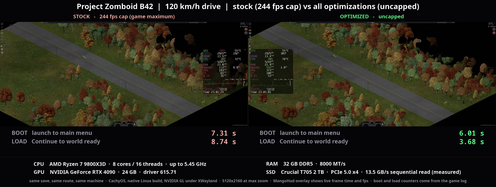

# PZ_Optimization

Performance patches for **Project Zomboid Build 42** on the Java side of the game.
Not a Lua mod: a set of drop-in `.class` files that shadow 24 game classes, remove
the worst stalls from the chunk streamer, the renderer and the loading path, and
leave `projectzomboid.jar` untouched. Every change has a kill switch, and every
number in this file comes from the hands-off benchmark harness in this repo.

**Current target: Build 42.20.4, jar revision `b0bbce05d5`, Linux and Windows.**
Both Steam depots ship the same jar; Linux builds the classes from source, Windows
unpacks the prebuilt zip. The overrides refuse to run against any other revision
(they log one line and the game behaves as stock).

---

## Contents

1. [Results at a glance](#results-at-a-glance)
2. [How the optimizations work](#how-the-optimizations-work)
3. [How the install works without touching the jar](#how-the-install-works-without-touching-the-jar)
4. [Install, step by step](#install-step-by-step)
5. [Settings](#settings)
6. [Known limitations](#known-limitations)
7. [Benchmark harness](#benchmark-harness)
8. [Repository layout](#repository-layout)

---

## Results at a glance

All runs: same save, same car, same 1,200-tile highway route east of Rosewood, max
zoom, 5120x2160, native Linux build, NVIDIA OpenGL. Machine: Ryzen 7 9800X3D,
RTX 4090, Crucial T705 NVMe, 32 GB DDR5. "Stock" is this build with every
optimization switched off, which reproduces the shipped game exactly.

### 120 km/h drive, stock at its 244 fps cap vs optimized uncapped, with boot and load

Full video with sound: https://www.youtube.com/watch?v=6jaipKCG7Po. Runs `sbs-stock120-1` /
`sbs-opt120-uncap-1`, 2026-09-19; stock has the in-game limiter at its maximum (244) and every
optimization off, including the boot and load ones.

**Boot and load** (real time; both games are launched together, the optimized one is in the
world and waiting while stock is still loading):

[](https://www.youtube.com/watch?v=6jaipKCG7Po)

**The drive** (first 10 s of the route, then the result lines):

[](https://www.youtube.com/watch?v=6jaipKCG7Po)

| Metric | Stock (244 cap) | Optimized (uncapped) | Change |
|---|---|---|---|
| Boot, launch to main menu | 7.31 s | 6.01 s | -18 % |
| Load, Continue to world ready | 8.74 s | 3.68 s | -58 % |
| fps, mean | 122 | 412 | 3.4x |
| Frame time, mean | 8.2 ms | 2.4 ms | -71 % |
| Frame time, p99 | 18.9 ms | 6.3 ms | -67 % |
| Frame time, p99.9 | 22.6 ms | 11.4 ms | -50 % |
| Worst frame | 53.1 ms | 23.0 ms | -57 % |
| 1 % low fps | 57 | 147 | 2.6x |
| GPU busy | 91 % | 86 % | uncapped, so the GPU stays busy |

### 60 km/h drive, 240 fps cap (the first video)

[](docs/media/drive-60kmh-stock-vs-optimized.mp4)

Runs `show-stock-1` / `show-opt-1` (in-game frame sampler); the "at the cap" row
is from MangoHud on the repeat pair `show-stock-2` / `show-opt-2`.

| Metric | Stock | Optimized | Change |
|---|---|---|---|
| Frame time, mean | 8.2 ms | 4.2 ms | 2.0x |
| Frame time, p90 | 14.4 ms | 4.2 ms | 3.4x |
| Frame time, p99 | 18.3 ms | 5.4 ms | 3.4x |
| Frame time, p99.9 | 23.1 ms | 18.4 ms | see note |
| fps, mean | 121 | 238 (capped at 240) | 2.0x |
| Frames sitting at the 240 fps cap | 34 % | 86 % | |
| GPU busy | 92 % | 54 % | half the GPU work |
| Chunk latency, p50 (ask to ready) | 154 ms | 4 to 5 ms | 30x |
| Chunk latency, p99 | 296 ms | 21 ms | 14x |
| Render thread busy | 74 % | 12 % | |

Note: the remaining p99.9 is a Lua `OnTick` burst every 2.00 s from the
PZDashboard mod, not this code. With that mod disabled the same route runs p99.9
at 11.8 ms.

### 120 km/h drive, stock at its 244 fps cap vs optimized uncapped (the second video)



The video itself (396 MB, 3840x1450, 63 s) is too large for the repository; it
is published on YouTube with the description in
[`docs/media/drive-120kmh-stock-244cap-vs-optimized-uncapped.youtube.txt`](docs/media/drive-120kmh-stock-244cap-vs-optimized-uncapped.youtube.txt).

Runs `sbs-stock120-1` / `sbs-opt120-uncap-1`, route window 39 s at about 122 km/h.
Both sides fall off the cap here, so the difference is pure per-frame cost.

| Metric | Stock (244 cap) | Optimized (uncapped) | Change |
|---|---|---|---|
| Boot, launch to main menu | 7.31 s | 6.01 s | -18 % |
| Load, Continue to world ready | 8.74 s | 3.68 s | -58 % |
| fps, mean | 122 | 412 | 3.4x |
| Frame time, mean | 8.2 ms | 2.4 ms | -71 % |
| Frame time, p99 | 18.9 ms | 6.3 ms | -67 % |
| Frame time, p99.9 | 22.6 ms | 11.4 ms | -50 % |
| Worst frame | 53.1 ms | 23.0 ms | -57 % |
| Frames over 33 ms | 1 | 0 | |
| 1 % low fps | 57 | 147 | 2.6x |
| GPU busy | 91 % | 86 % | |
| Game CPU (of one core) | 289 % | 347 % | |


### Boot and load on a warm cache

Bench save, `harness/loadtime.py`, best measured pair in the load loop
(`docs/plan-instant-load.md`). The first boot after a cache wipe is slower because
the animation and texture-pack caches under `~/Zomboid/pzopt/` are being written.

| Phase | Stock | Optimized |
|---|---|---|
| Launch to main menu | 7.35 s | 5.00 s |
| Continue to world ready | 6.53 s | 4.03 s |

### Chunk latency, per streamer change

100 s route, `docs/results.md`. Time from the game asking for a chunk to the chunk
being ready for the game thread.

| Variant | p50 | p90 | p99 |
|---|---|---|---|
| Stock | 166 ms | 310 ms | 1024 ms |
| Wake on enqueue only | 20 ms | 184 ms | 811 ms |
| Wake + 4 recalc workers (default) | 9.3 ms | 84 ms | 517 ms |
| Wake + 8 workers | 9.1 ms | 87 ms | 503 ms |

---

## How the optimizations work

The game runs one main thread that simulates and renders, one streamer thread that
loads chunks, a save worker and an async file system. At max zoom while driving,
profiling (JFR) showed the main thread spending 80 % of an ordinary frame inside
`IsoCell.render`, and a third of *all* samples in the "translucent" pass that
redraws every tree, window and fence each frame. The streamer was idle 90 % of the
time but still delivered chunks 150 ms late because of a polling sleep. The
loading path was a chain of single-threaded parsers. Each group of changes below
attacks one of those.

Every item names its `pzopt.properties` key. Defaults are the adopted set; a
key set to `false` or `0` restores stock behaviour for that item alone.

### 1. Chunk streaming

**Wake the streamer on enqueue** (`wake`). The stock streamer thread checks its
queue every 140 ms. A chunk the game asked for waited about 150 ms doing nothing
before any work started. The override signals the thread the moment a job is
added. This alone takes chunk latency from 166 ms to 20 ms at the median.

**Parallel grid recalc** (`parallel`, `workers`). The expensive part of loading a
chunk is recalculating every square against its 3x3x3 neighbourhood. Stock does it
on the one streamer thread, and a mutable static (`IsoChunk.chunkGetter`) makes two
chunks recalculating at once unsafe. The override gives each job its own getter,
runs the pass on a small pool, and publishes results back in queue order so the
game thread sees chunks exactly as stock would. A worker failure is retried on the
streamer thread. The output is byte-identical to stock: a parity gate compares
131,133 squares in 1,653 chunks at 1, 2, 4 and 15 workers.

**Hot-save throttle** (`hotsaveIntervalSec`). Whenever the chunk save queue drains,
stock serialises the whole meta grid, game time, world map and entities on the
game thread. While driving the queue drains every 0.45 s, so this was a 2 to 5 ms
stall twice a second. The override runs it at most every 30 s.

### 2. Renderer

The game caches walls and floors of each chunk level in a texture and redraws only
what changed. Trees, windows and "translucent" tiles were excluded from that cache
and drawn every frame, thousands of draws at max zoom.

**Static trees bake into the chunk texture** (`treesInChunkTexture`). A tree is
drawn per frame only while it fades around the player, sways in the wind or
carries an effect; the level texture is invalidated when a tree changes state.
Frame mean 6.2 to 5.2 ms, GPU busy 84 to 61 % on its own.

**Windows and glass doors bake** (`windowsInChunkTexture`). Within noise alone,
kept because it removes 30 to 130 draws per frame at no cost.

**Per-frame bake budget** (`bakeBudget`). When a new chunk row comes into view
stock bakes dozens of chunk textures in one frame. The override bakes at most 8
per frame; textures baked before keep their previous image for a frame, never-baked
ones wait a frame. Slow frames were 26 % bakes; p99 13.8 to 8.3 ms.

**Per-frame lighting budget** (`lightingBudget`). The same idea for the
square-lighting refresh of chunks (12 % of slow frames). A pass that stops early
continues next frame and never drops a dirty flag.

**Cutaway occluder-mask replay** (`cutawayFast`). Clean chunk levels replay their
stored occluder bitmask instead of re-testing every square each frame. The mask
is exact; an earlier int-shifted version drew black one-tile rectangles beside
walls and was replaced.

**Persistently mapped sprite buffers** (`persistentVbo`, **off by default**).
Stock orphans and re-maps a 64 KB vertex buffer per sprite batch. The override
allocates immutable storage once and fences per buffer. Render thread busy 63 to
35 %, but no gain at the 240 cap and suspected in one black building lot, so it
stays off until that is understood.

**Translucent-flagged tiles bake** (`translucentTilesInChunkTexture`, **off by
default**). 16,476 tile definitions carry this flag (damaged fences, railings,
crops, wall decorations). Baking them cut per-frame draws from about 3,000 to
about 100, but some `Translucent` tileset tiles bake opaque black, so it is off
until the tile set is filtered.

### 3. Boot: launch to main menu

**FMOD on a boot thread** (`fmodAsync`). Sound system and 12 bank files (1.6 s)
initialise on a thread started at the top of the main thread's init and are
joined right before the first sound script needs them.

**Boot-time file-pool pump** (`bootPump`, `bootFileThreads`, `earlyModels`). The
async file system only advanced once per rendered frame, and frames start at the
menu, so for 4 s of boot the pool sat idle. A thread pumps it every 3 ms from the
start of init, and model creation moves right after the scripts load so the
2,209 animation imports are queued 2 s earlier.

**Lua precompile** (`luaPrecompile`). Every Lua file (game, mods, map objects)
compiles on a pool during boot; the game's `LuaCompiler` takes the prototype from
that cache, keyed by name and contents. A miss goes through the stock path.

**Animation clip cache** (`animClipCache`). Importing 2,209 `.X` animation files
through jassimp costs 14 to 17 thread-seconds per boot. After a stock import the
resulting clips are written under `~/Zomboid/pzopt/anims/` and read from there on
later boots (2.9 thread-seconds).

**Texture pack index** (`packIndex`). Version-0 texture packs were scanned byte by
byte (526 MB) at every boot to find page boundaries. The offsets are kept in
`~/Zomboid/pzopt/packs/*.idx` so the reader seeks.

**Linear script parser** (`scriptParserFast`). `ScriptParser.stripComments` was
quadratic (a `StringBuilder.replace` per comment on a multi-MB string, 1.56 s);
now a single pass with the same nesting rule and the same output (unit-tested).

**Item parameter switch** (`itemParamSwitch`). `Item.DoParam` tested each
parameter against a chain of 361 `equalsIgnoreCase` calls, 0.9 s of boot. Now a
`switch` on the lower-cased key.

**Logo screens skipped.** `TISLogoState` is a from-scratch replacement that goes
straight to the main menu.

### 4. Load: Continue to world ready

**File pool sized to the machine** (`fileThreads`, `fileInflight`). Stock decodes
every texture, model and depth map on 4 threads with 16 tasks in flight; the
loader thread then waits 3.5 s for them. Now half the cores and 4 tasks per thread
(more starves the game's own 8 meta-grid loader threads).

**Depth maps decode concurrently** (`parallelDepthMaps`). Stock ran all 218
tileset loads one at a time under a single lock, 2 s of one thread.

**Loader-thread fixes** (`loaderCpuFixes`), same results as stock:
`checkVehiclesZones` was called 11 times per load over 9,690 zones with an O(n²)
duplicate check; `MapCollisionData.init` and `IsoMetaCell.getChunk` looked up the
lot header per chunk instead of per cell; `checkBuildingAndRoomIDs` used
`indexOf` per room (O(rooms²) per cell).

**Animation sets preloaded at boot** (`preloadAnimSets`). The player and zombie
animation-set XML trees (1.1 s of JAXB on the loader thread) parse on a boot thread
instead.

**Model shader cache** (`shaderCache`). `Model.CreateShader` posted to the render
thread and waited one loading-screen step per model. On a laptop whose
loading-screen step is 220 ms the 73 animal models cost 16.5 s (GitHub issue #1).
Repeat shaders now come from a cache.

**Wider recalc pool while loading** (`loadWorkers`). The 361 chunks of the initial
chunk map recalc on half the cores, then the pool shrinks back.

**No fade to black** (`noLoadFade`). The loading screen's 350 ms of sleeps before
the world's own 2 s fade-in are removed.

### 5. Frame cap

The Display options get a real **Uncapped** entry and a separate **Menu framerate**
combo, plus 300, 330, 400, 430 and 500 fps entries in both (`pzopt.FrameCap`,
Lua under `src/lua/`, setting stored in `~/Zomboid/pzopt/framecap.ini`). The
in-game choice survives the game's own rewrite of `options.ini`.

### What was measured and not adopted

Lighting re-bake hold-off, cutaway visit radius, grid-stack interval (all within
noise); G1 instead of ZGC (p99 -13 % but 3x the frames over 33 ms); Mesa Zink
instead of NVIDIA GL (blocks 1.8 ms per frame in swap); a 256 MB texture upload
buffer (a 5 s frame a few seconds into the world); native Wayland (a wash at the
240 cap).

---

## How the install works without touching the jar

The game's launcher config `ProjectZomboid64.json` ships with
`"classpath": [".", "projectzomboid.jar"]`. The install directory comes before
the jar, so a loose `.class` file in the install directory **shadows** the same
class inside the jar. The overrides are copied in as loose files and removed by
deleting them; the jar's checksum never changes. This is the "manual class
replacement" method described on the [PZ wiki's Java page](https://pzwiki.net/wiki/Java).

Shadowed classes (24 game classes plus one from-scratch shim):

| Area | Classes |
|---|---|
| Streaming and render | `zombie.iso.IsoChunk`, `zombie.iso.WorldStreamer`, `zombie.iso.ChunkSaveWorker`, `zombie.iso.IsoMetaCell`, `zombie.core.VBO.GLVertexBufferObject`, `zombie.iso.fboRenderChunk.FBORenderCell`, `zombie.GameWindow`, `zombie.core.PerformanceSettings` |
| Boot and load | `zombie.fileSystem.FileSystemImpl`, `zombie.fileSystem.TexturePackDevice`, `zombie.tileDepth.TileDepthTextures`, `zombie.core.textures.TextureIDAssetManager`, `zombie.MapCollisionData`, `zombie.iso.IsoMetaGrid`, `zombie.gameStates.GameLoadingState`, `zombie.buildingRooms.BuildingRoomsEditor`, `zombie.core.skinnedmodel.advancedanimation.AnimationSet`, `zombie.core.skinnedmodel.model.AnimationAssetManager`, `zombie.core.skinnedmodel.model.Model`, `zombie.scripting.ScriptParser`, `zombie.scripting.objects.Item`, `se.krka.kahlua.luaj.compiler.LuaCompiler` |
| Window shims | `org.lwjglx.opengl.Display`, `org.lwjglx.input.Mouse` |
| From scratch | `zombie.gameStates.TISLogoState` |

The edited sources live under `src/overrides/` with every change marked
`// pzopt:` and described in prose in `docs/override-edits.md`. The new helper
code is the `pzopt` package under `src/pzopt/`.

Safety rails:

- **Build guard.** The classes record the game revision they were compiled against
  and disable themselves, with one log line, when the installed game differs.
  `scripts/pzopt.sh install` refuses to install a mismatched build.
- **Signature check.** The build fails if any non-private member of a shadowed
  class is missing or changed, so other game classes always link.
- **Kill switches.** Every optimization is a key in `pzopt.properties`.
- **Game-thread-only code stays there.** Pathfinding registration is never reached
  from a worker; dev builds assert it.
- **Save format and network payloads are untouched.**
- **All files the mod writes** (caches, frame-cap setting, traces) stay under
  `~/Zomboid/pzopt/`. The game directory only receives the files listed in
  `pzopt-installed.txt`.

---

## Install, step by step

The game is installed through Steam on both platforms and the Windows depot
ships the same `projectzomboid.jar` as the Linux one, so the same class files
work on both. The difference is how you get them: on **Linux** you build them
from this repository against your own jar; on **Windows** you unpack the
prebuilt zip from the [release page](https://github.com/DiegoVillalobosFlores/PZ_Optimization/releases)
and nothing is compiled. Every step below has a Linux part and a Windows part.
Nothing here is a Workshop mod.

Windows commands are PowerShell (Start menu, type `powershell`). They use `$PZ`
for the game folder; the value below is Steam's default, adjust it if your
library is elsewhere (Steam, right-click the game, Manage, Browse local files).

### What you need

| Requirement | Linux | Windows |
|---|---|---|
| Project Zomboid **Build 42.20.4** (Steam, Properties, Betas) | yes | yes |
| A JDK 25 or newer (`javac`, `javap`) | yes, to compile against your jar | no |
| Python 3 | yes, the install script reads the launcher JSON | no |
| `git`, `unzip`, `bash` | yes | no |
| The release zip `pzopt-b0bbce05d5-classes.zip` | no | yes (518 KB) |

Linux: install a JDK with your package manager if `javac -version` fails:

```sh
# Arch / CachyOS
sudo pacman -S jdk-openjdk
# Debian / Ubuntu
sudo apt install openjdk-25-jdk      # or the newest available
# Fedora
sudo dnf install java-latest-openjdk-devel
```

### Step 1. Close the game

Both platforms. The overrides are read when the game starts; quit Project
Zomboid before installing or removing them.

### Step 2. Get the files

**Linux:** clone the repository.

```sh
git clone https://github.com/DiegoVillalobosFlores/PZ_Optimization.git
cd PZ_Optimization
```

**Windows:** download `pzopt-b0bbce05d5-classes.zip` from the
[release page](https://github.com/DiegoVillalobosFlores/PZ_Optimization/releases)
into your Downloads folder. The revision in the file name must be the one your
game reports (Build 42.20.4 is `b0bbce05d5`); a zip for another revision
installs fine but the classes disable themselves at start-up. If you also want
the repository (harness, sources), `git clone` works on Windows too when the
target is a short path such as `C:\Users\<you>\PZ_Optimization` (some files
sit ten folders deep; from a long path the checkout fails with "Filename too
long" unless you pass `-c core.longpaths=true`). The build scripts do not run
on Windows: the zip is built on Linux with `scripts/build.sh`.

### Step 3. Tell the commands where the game is

**Linux:** only if the game is not in `/games/steamapps/common/ProjectZomboid`.
Export the path once in the shell you will use for the next steps:

```sh
export PZ_ROOT="$HOME/.local/share/Steam/steamapps/common/ProjectZomboid"
```

The folder is right if it contains a `projectzomboid/` subfolder with
`projectzomboid.jar` and `ProjectZomboid64.json` inside.

**Windows:** set `$PZ` and check the launcher config and that nothing is
installed yet. Do this in every new PowerShell window.

```powershell
$PZ = "C:\Program Files (x86)\Steam\steamapps\common\ProjectZomboid"
Get-Content "$PZ\ProjectZomboid64.json" | Select-String -Context 0,3 classpath
Test-Path "$PZ\pzopt"; Test-Path "$PZ\zombie"; Test-Path "$PZ\org"; Test-Path "$PZ\se"
```

The classpath block must list `"."` before `"projectzomboid.jar"` (it does on
the stock depot; that order is what lets loose class files shadow the jar) and
the four `Test-Path` lines must print `False`.

### Step 4. Build the class files

**Linux:**

```sh
scripts/build.sh
```

This compiles everything under `src/` against your `projectzomboid.jar` and ends
with a line like `built 95 class files into build/classes for game revision
b0bbce05d5`. It also runs a structural check against the stock classes and fails
loudly if your game revision does not match the sources. Optional but
recommended, the unit tests (no game needed, a few seconds):

```sh
scripts/test.sh
```

**Windows:** nothing to build. The zip carries the finished class files plus
`pzopt-files.txt`, the list of every file it adds.

### Step 5. Install

**Linux:**

```sh
scripts/pzopt.sh install
```

The script first checks that the launcher classpath puts `.` ahead of the jar
and that your game revision matches the build, then copies `build/classes/` into
the game folder and records every file it wrote in `pzopt-installed.txt`. It
refuses to overwrite any file that already exists. The last line confirms the jar
checksum did not change.

**Windows:** unpack the zip straight into the game folder. It only adds files
and never touches `projectzomboid.jar`. `Expand-Archive` refuses to overwrite
existing files unless `-Force` is given; do not give it.

```powershell
Expand-Archive -Path "$env:USERPROFILE\Downloads\pzopt-b0bbce05d5-classes.zip" -DestinationPath $PZ
```

### Step 6. Verify

**Linux:**

```sh
scripts/pzopt.sh status
```

Expected output: `installed: yes`, the same revision on the `game revision` and
`installed for` lines, and a file list with no `MISSING` or `MODIFIED` entries.

**Windows:**

```powershell
Get-Content "$PZ\pzopt\build-info.properties" | Select-String "^revision"
(Get-Content "$PZ\pzopt-files.txt" | Where-Object { -not (Test-Path (Join-Path $PZ $_)) }).Count
```

Expected: `revision=b0bbce05d5` and `0` (no file from the list is missing).

### Step 7. Play

Both platforms: launch the game from Steam as usual. The console log
(`~/Zomboid/console.txt` on Linux, `%USERPROFILE%\Zomboid\console.txt` on
Windows) shows `[pzopt] loaded override ...` lines in its first seconds, one
per class, each saying `active`. The Display options now have an **Uncapped**
framerate entry, 300 to 500 fps entries, and a **Menu framerate** combo. On
Windows:

```powershell
Select-String -Path "$env:USERPROFILE\Zomboid\console.txt" -Pattern "\[pzopt\] loaded override" | Measure-Object | Select-Object -ExpandProperty Count
```

If a line says the overrides were built for another revision, the game and the
files do not match and everything runs as stock. The first boot after install
is slower than later ones: the animation clip cache and texture-pack index
under `Zomboid/pzopt/` are written on that boot and read on every boot after
it.

### Changing a setting

Both platforms: create `pzopt.properties` next to `projectzomboid.jar` (on
Windows that is `$PZ\pzopt.properties`) with only the keys you want to change;
everything else keeps the adopted default, for example:

```properties
workers=2
hotsaveIntervalSec=60
treesInChunkTexture=false
```

On Linux `scripts/pzopt.sh status` prints the file when it exists. See
[Settings](#settings).

### Uninstall

**Linux:**

```sh
scripts/pzopt.sh uninstall
```

Removes exactly the files it installed and the empty folders it created, then
deletes the manifest.

**Windows:** the same, driven by the zip's file list.

```powershell
$PZ = "C:\Program Files (x86)\Steam\steamapps\common\ProjectZomboid"
Get-Content "$PZ\pzopt-files.txt" | ForEach-Object { Remove-Item -LiteralPath (Join-Path $PZ $_) -ErrorAction SilentlyContinue }
Remove-Item "$PZ\pzopt-files.txt", "$PZ\pzopt.properties" -ErrorAction SilentlyContinue
foreach ($d in "pzopt","zombie","org","se","media\lua\client\pzopt") {
  Get-ChildItem "$PZ\$d" -Recurse -Directory -ErrorAction SilentlyContinue | Sort-Object FullName -Descending |
    Where-Object { -not (Get-ChildItem $_.FullName -Force) } | Remove-Item
  if ((Test-Path "$PZ\$d") -and -not (Get-ChildItem "$PZ\$d" -Force)) { Remove-Item "$PZ\$d" }
}
Test-Path "$PZ\pzopt"   # False
```

On both platforms the jar was never modified, so no Steam file verification is
needed. The caches under `Zomboid/pzopt/` can be deleted by hand; the frame-cap
setting lives there too (`framecap.ini`), and without the overrides the game
uses whatever `options.ini` holds.

### After a game update

The classes are compiled against one exact jar. After Steam updates the game they
disable themselves (one log line, stock behaviour).

**Linux:** either wait for a release of this repo that targets the new build, or
on an unchanged revision (a Steam re-verify, for example) just run:

```sh
scripts/pzopt.sh uninstall
scripts/build.sh
scripts/pzopt.sh install
```

If `build.sh` reports a revision or signature mismatch, the game changed and the
overrides need updating (`scripts/regen-overrides.sh` plus the edit log is the
maintainer's path; see `.claude/skills/game-update`). Never copy class files
built for an older revision onto a newer game.

**Windows:** uninstall with the commands above and wait for a zip whose name
carries the new revision. Do not leave old class files in place; they are inert
but pointless.

### Windows results

First Windows numbers (bench route, 5120x2160, 500 fps cap, zoom 2.5, two
stock runs for the noise floor): stock 122 fps and p99 26.1 ms, optimized 194 fps
and p99 18.5 ms, chunk latency p50 199 → 37 ms. Details, boot timings and the
test procedure are in [docs/windows-test.md](docs/windows-test.md). The
benchmark harness runs on Windows through `harness/run-win.ps1`.

---

## Settings

Keys go in `pzopt.properties` in the game directory, or as `-Dpzopt.<key>=`
JVM properties. Full list with comments: `src/pzopt/pzopt/Config.java`.

| Key | Default | What it controls |
|---|---|---|
| `parallel` | `true` | recalc chunks on a worker pool (`false` = stock single thread) |
| `workers` | `min(4, cores-1)` | recalc pool width |
| `wake` | `true` | wake the streamer on enqueue instead of the 140 ms poll |
| `hotsaveIntervalSec` | `30` | minimum seconds between game-thread hot saves (`0` = stock) |
| `treesInChunkTexture` | `true` | static trees bake into the chunk texture |
| `windowsInChunkTexture` | `true` | windows and glass doors bake |
| `translucentTilesInChunkTexture` | `false` | `Translucent`-flagged tiles bake (black tile bug open) |
| `bakeBudget` | `8` | chunk textures baked per frame (`0` = unlimited) |
| `lightingBudget` | `8` | chunk lighting refreshes per frame (`0` = stock) |
| `cutawayFast` | `true` | replay the stored occluder mask on clean levels |
| `persistentVbo` | `false` | persistently mapped sprite buffers |
| `fileThreads` / `fileInflight` | `max(4, cores/2)` / `4x` | async file system width and queue depth |
| `parallelDepthMaps` | `true` | decode depth-map tilesets concurrently |
| `loaderCpuFixes` | `true` | algorithmic fixes on the loader thread |
| `scriptParserFast` | `true` | linear script parser |
| `itemParamSwitch` | `true` | `Item.DoParam` switch dispatch |
| `fmodAsync` | `true` | FMOD init on a boot thread |
| `bootPump` / `bootFileThreads` / `earlyModels` | `true` / `cores-6` / `true` | boot-time file pool pump |
| `luaPrecompile` | `true` | compile all Lua on a pool at boot |
| `preloadAnimSets` | `true` | parse animation sets at boot |
| `animClipCache` | `true` | cache imported animation clips under `~/Zomboid/pzopt/` |
| `packIndex` | `true` | cache texture-pack page offsets |
| `shaderCache` | `true` | reuse model shaders instead of one render step per model |
| `loadWorkers` | `max(workers, cores/2)` | recalc pool width while a world loads |
| `noLoadFade` | `true` | skip the loading screen's fade to black |
| `uncappedFps` | `auto` | `true`/`false` force the cap off/on for a run |
| `instrument` | `false` | write per-chunk and per-frame timings for the harness |

---

## Known limitations

Read this before installing on a machine you play on.

- **Version pin.** One exact game build. Every Build 42 patch needs a new build of
  these classes; until then they disable themselves.
- **Other Java mods.** Only one mod can replace a given class. Anything that also
  replaces `IsoChunk`, `WorldStreamer`, `GameWindow`, `Item`, `ScriptParser` or
  any class in the table above conflicts, and whichever file is found first wins
  silently. Mods built on ZombieBuddy or Leaf patch methods and can coexist when
  they do not patch the same methods. ZombieBuddy 2.3.3 with ZBBetterFPS loaded
  fine next to these class files with the optimizations switched off; both sets
  active together has not been tested.
- **Single-player only.** Several shadowed classes run server-side in multiplayer
  (`IsoChunk`, `WorldStreamer`, `ChunkSaveWorker`, `IsoMetaGrid`). None of that
  has been exercised. Do not install on a server or join one with this installed.
- **Security.** Build 42.20.4 removed Lua `loadstring` and restricted the file
  types Lua may write. This mod does not widen either: the `LuaCompiler` override
  only caches compiled prototypes of the same source text, and all writes stay
  under `~/Zomboid/pzopt/`.
- **Visual changes still under soak.** Baked trees, windows and the cutaway mask
  have been verified on the bench route and on copies of real saves, but a long
  free-play soak (interiors, zombies behind fences, curtain and door state
  changes) is still open. Two rendering flags stay off because of known artifacts
  (see [Renderer](#2-renderer)).
- **Platforms.** Measured on the native Linux depot with NVIDIA GL under XWayland
  (Mesa Zink and native Wayland too) and on Windows 11 with NVIDIA GL
  (`docs/windows-test.md`). On Windows the bench route was run and the frame-cap
  combos checked; the long free-play soak above is open there as well.
- **Development install contents.** The build also carries the harness classes
  (`pzopt.Harness`, `pzopt.AutoStart`, `pzopt.Parity`, `pzopt.Stats`,
  `pzopt.ScriptDump`). They are inert unless the harness launches the game.

---

## Benchmark harness

`harness/run.sh` does one hands-off game run: resets a bench save from a template,
auto-continues into it, runs a scripted route, quits, and collects logs, sysmon
samples, an optional MangoHud CSV, optional JFR and an optional screen recording
into `harness/runs/<label>-<timestamp>/`. The bench save template is checked in
as `harness/bench-save/pzopt-bench-template.tar.zst`; restore it once with:

```sh
zstd -dc harness/bench-save/pzopt-bench-template.tar.zst | tar -C ~/Zomboid/Saves/Sandbox -xf -
```

Modes: `bench` (teleport route, fixed tiles per second), `drive` (spawns a car,
cruise control, follows the road), `parity` (captures every chunk's recalc output
for the byte-for-byte comparison), `verify` (a copy of a real save, for visual
checks).

```sh
# the two runs behind the 60 km/h video
harness/run.sh --label show-stock --mode drive --flag route=E:1200 --record \
  --mangohud 98 --mangohud-config config/mangohud-showcase.conf --launcher direct \
  --prop instrument=true --prop parallel=false --prop wake=false --prop persistentVbo=false \
  --prop treesInChunkTexture=false --prop windowsInChunkTexture=false \
  --prop translucentTilesInChunkTexture=false --prop hotsaveIntervalSec=0 \
  --prop bakeBudget=0 --prop lightingBudget=0 --prop cutawayFast=false
harness/run.sh --label show-opt --mode drive --flag route=E:1200 --record \
  --mangohud 98 --mangohud-config config/mangohud-showcase.conf --launcher direct \
  --prop instrument=true

python3 harness/analyze.py harness/runs/show-stock-* harness/runs/show-opt-*   # frame tail + utilization
python3 harness/compare.py harness/runs/show-stock-1-* harness/runs/show-opt-1-*
python3 harness/loadtime.py harness/runs/<run>                                # boot and load phases
python3 harness/attribute.py --thread main harness/runs/<jfr-run>             # JFR attribution
python3 harness/dashboard.py                                                  # docs/benchmark-progress.html
```

Steam launches need the launch options set to
`<repo>/harness/steam-launch.sh %command%`; `--launcher direct` starts the native
game itself when Steam is not running. Bench runs must pin `--flag zoom=max`:
frame-time baselines are only comparable at the same zoom, resolution and
renderer. Measurement runs should use `--no-dashboard` to keep the PZDashboard
mod's 2 s collectors out of the tail.

On Windows, `harness/run-win.ps1` does the same bench (no MangoHud, JFR or
recording; CPU and GPU load from `Get-Counter` and `nvidia-smi`), and the
analysis scripts run on the embeddable Python:

```powershell
harness\run-win.ps1 -Label bench-opt -Flag zoom=max -Prop instrument=true
harness\run-win.ps1 -Label bench-stock -Flag zoom=max -Prop instrument=true,parallel=false,wake=false,treesInChunkTexture=false,windowsInChunkTexture=false,bakeBudget=0,lightingBudget=0,cutawayFast=false,hotsaveIntervalSec=0
python harness\analyze.py harness\runs\bench-opt-*
```

---

## Repository layout

| Path | What |
|---|---|
| `src/pzopt/pzopt/` | New classes: `Config`, `Overrides`/`BuildInfo` (build guard), `RecalcPool`, `OrderedPublisher`, `StreamerWake`, `BootPump`, `LuaPrecompiler`, `AnimClipCache`, `ModelShaders`, `FrameCap`, `Stats`, `Harness`/`Parity` |
| `src/overrides/` | The 24 shadowed game classes, edits marked `// pzopt:` |
| `src/shims/` | From-scratch replacements (`TISLogoState`) |
| `src/lua/` | The frame-cap options Lua, installed under `media/lua/client/pzopt/` |
| `scripts/` | `build.sh`, `pzopt.sh`, `test.sh`, `accept.sh`, `regen-overrides.sh`, `decompile.sh`, `pz-env.sh` |
| `harness/` | `run.sh` (Linux) and `run-win.ps1` (Windows), analysis scripts, `parity-gate.sh`, the `pzopt-harness` Lua mod, bench save template, `baseline/` captures (`baseline/windows/` for the Windows runs) |
| `config/` | MangoHud profiles |
| `tools/` | Standalone Java probes (JFR sample dump, GLFW swap probe, static audit) |
| `tests/` | JVM-only unit tests (`scripts/test.sh`) |
| `docs/` | `results.md` (every run, in order), `override-edits.md` (every edit, in prose), the plans, `benchmark-progress.html` |
| `docs/media/` | The comparison videos, posters and the results chart |

Project Zomboid is by The Indie Stone. This repository contains no game assets;
the edited class sources under `src/overrides/` are derived from the shipped jar
for the sole purpose of these patches.
