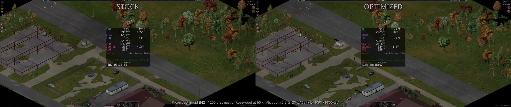
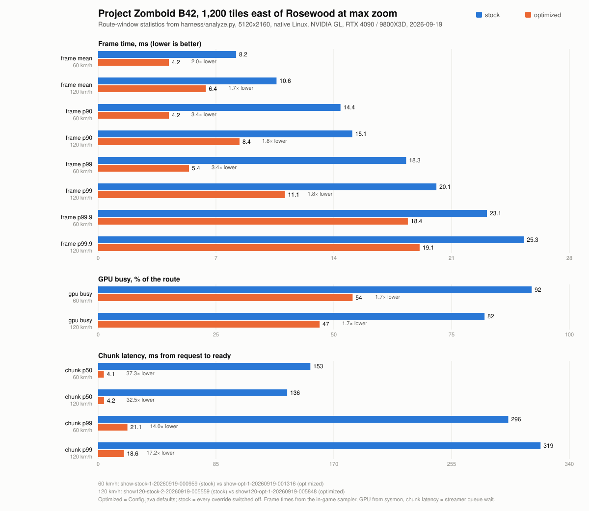

# PZ_Optimization

Performance patches for **Project Zomboid Build 42** itself, the Java game, not a
Lua mod. Drop-in `.class` overrides that shadow five game classes, remove the
worst stalls from the chunk streamer and the renderer, and leave the shipped
jar untouched. Every change has a one-line kill switch and every number below
comes from a scripted, hands-off benchmark harness that ships in this repo.

## The result

Same save, same car, same 1,200 tiles of highway east of Rosewood at 60 km/h,
max zoom, 5120x2160, native Linux build, NVIDIA OpenGL. Stock on the left,
this repo's default settings on the right. MangoHud is on both sides.

<video src="https://github.com/DiegoVillalobosFlores/PZ_Optimization/raw/master/docs/media/drive-60kmh-stock-vs-optimized.mp4" controls muted loop playsinline width="100%"></video>

[](docs/media/drive-60kmh-stock-vs-optimized.mp4)

*(If the player does not load, open
[`docs/media/drive-60kmh-stock-vs-optimized.mp4`](docs/media/drive-60kmh-stock-vs-optimized.mp4)
directly. The recording is the 2560x540 re-encode of the two `show-*`
harness runs below; the full-resolution originals live in `harness/runs/`,
which is not committed.)*

Frame times from the in-game sampler over the route window (`harness/analyze.py`,
runs `show-stock-1` and `show-opt-1`, 2026-09-19; the "at the cap" row is from
MangoHud on the repeat pair `show-stock-2` / `show-opt-2`, the runs in the video):

| | stock | optimized | |
|---|---|---|---|
| frame time, mean | 8.2 ms | 4.2 ms | 2× |
| frame time, p90 | 14.4 ms | 4.2 ms | 3.4× |
| frame time, p99 | 18.3 ms | 5.4 ms | 3.4× |
| frame time, p99.9 | 23.1 ms | 18.4 ms | see "what is left" |
| fps, mean | 121 | 238 (240 cap) | |
| frames at the 240 fps cap | 34 % | 86 % | |
| GPU busy | 92 % | 54 % | |
| chunk latency, p50 (ask → ready) | 154 ms | 4–5 ms | 30× |
| chunk latency, p99 | 296 ms | 21 ms | 14× |
| render thread busy | 74 % | 12 % | |

The same comparison at twice the speed (race car, ~120 km/h, the route in
39 s, runs `show120-stock-2` / `show120-opt-1`), where both sides fall off the
frame cap and the difference is pure per-frame cost:



Regenerate with `python3 harness/readme-chart.py` after pasting new
`harness/analyze.py` figures into it.

Stock driving at max zoom is GPU-bound and hovers at 120 fps; with the
overrides the same route sits on the frame cap for 99 % of frames with the
GPU at half load, so there is headroom left for a heavier scene or a slower
card. Machine: Ryzen 7 9800X3D, RTX 4090, NVMe, game 42.20.4 (`b0bbce05d5`).

An earlier pair of runs on the same route (`drive-stock-road-1` vs
`drive-road-2`, `docs/results.md`) gives the same picture: mean 8.1 → 4.2 ms,
p99 18.4 → 5.4 ms, GPU 92 → 55 %.

## What the optimizations are

Each item is a runtime setting in `pzopt.properties` (game directory; the
defaults are the adopted set). Effects are from the A/B runs in
`docs/results.md`; the code-level description of every edit is in
`docs/override-edits.md`.

### Chunk streaming (`WorldStreamer`, `IsoChunk`)

1. **Wake the streamer on enqueue** (`wake=true`). The stock streamer thread
   polls its queue with a fixed 140 ms sleep, so a chunk the game asked for
   waited ~150 ms doing nothing before any work started. The override signals
   the thread when a job is added. Chunk latency p50 166 → 20 ms on its own.
2. **Parallel grid recalc** (`parallel=true`, `workers=4`). The expensive part
   of loading a chunk is recalculating every square against its 3×3×3
   neighbourhood. Stock does this on the single streamer thread, and the
   game's `IsoChunk.chunkGetter` is a mutable static that makes two chunks
   recalculating concurrently unsafe. The override gives each job a local
   getter and runs the pass on a small pool, publishing results back in queue
   order (`OrderedPublisher`) so the game thread sees chunks exactly as
   stock would. A worker failure is retried on the streamer thread. Output is
   byte-identical to stock (parity gate: 131,133 squares in 1,653 chunks at
   W=1, 2, 4, 15). Together with the wake: p50 166 → 9 ms, p90 310 → 84 ms.

   Note that this alone did **not** move frame time on this machine; the
   streamer was never what stuttered. It is kept because it makes chunks
   appear 18× sooner and costs nothing on the game thread.

### Renderer (`FBORenderCell`, `GLVertexBufferObject`)

JFR attribution at max zoom showed the game thread spending 80 % of an ordinary
frame in `IsoCell.render`, and 35 % of *all* samples in the per-frame
"translucent" pass that re-draws every tree, window and fence each frame
instead of baking them into the cached chunk textures like walls and floors.

3. **Static trees bake into the chunk texture** (`treesInChunkTexture`). A
   tree is drawn per frame only while it fades around the player, is
   wind-animated or carries effects; the level texture is invalidated when a
   tree changes state. Frame mean 6.2 → 5.2 ms, GPU busy 84 → 61 %.
4. **Windows and glass doors bake** (`windowsInChunkTexture`). Within noise on
   its own, kept because it is harmless and removes 30–130 draws per frame.
5. **`Translucent`-flagged tiles bake** (`translucentTilesInChunkTexture`).
   16,476 tile definitions carry this flag (damaged fences, railings, wall
   decorations, crops, pylons, boulders…); the stock renderer drew
   1,500–3,600 of them every frame at max zoom. Baking them takes the
   per-frame count to 50–120. Frame mean 5.0 → 4.5 ms, p99 16.4 → 13.8 ms.
6. **Per-frame bake budget** (`bakeBudget=8`). When a new chunk row comes into
   view at max zoom, stock bakes dozens of chunk-level textures in one frame.
   The override bakes at most N per frame; a texture that was baked before
   keeps its previous image for a frame, never-baked ones wait a frame. Slow
   frames were 26 % bakes; p99 13.8 → 8.3 ms.
7. **Per-frame lighting budget** (`lightingBudget=8`). Same idea for the
   square-lighting refresh of chunks (12 % of slow frames); a pass that stops
   early continues next frame.
8. **Persistently mapped sprite buffers** (`persistentVbo`). Stock orphans
   and re-maps a 64 KB vertex buffer per sprite batch
   (`glBufferData` + `glMapBufferRange`), 25 % of render-thread samples. The
   override allocates immutable storage once, maps it persistently, and
   fences per buffer so the CPU never overwrites a batch the GPU still reads.
   Render thread busy 63 → 35 %. Falls back to stock without
   `GL_ARB_buffer_storage`.
9. **Cutaway occluder-mask replay** (`cutawayFast`). Clean chunk levels replay
   their stored occluder bitmask instead of re-testing every square each
   frame. Within noise on the benchmark route because the frame cap hides
   the CPU headroom; on by default, cheap.

### Save worker (`ChunkSaveWorker`)

10. **Hot-save throttle** (`hotsaveIntervalSec=30`). Whenever the chunk save
    queue drains, stock serialises the whole meta grid, game time, world map
    and entities on the game thread. While driving the queue drains every
    ~0.45 s, so this was a 2–5 ms game-thread stall twice a second (222
    episodes on a 100 s route). The override runs it at most every N seconds;
    0 restores stock.

### What is left

The p99.9 in the table above (18 ms) is not this repo's code: it is a Lua
`OnTick` burst every 2.00 s from the **PZDashboard** mod, whose collectors all
default to the same 2 s interval and fire on one tick (the fog sweep alone is
up to 6,000 Java calls). With the mod disabled the same route runs p99.9
11.8 ms. Fix belongs in that mod (stagger the collectors, spread the sweep).

Not adopted after measuring: lighting re-bake hold-off (`lightingRebakeMs`),
cutaway visit radius, grid-stack interval (all within noise), G1 instead of ZGC
(p99 −13 % but 3× the frames > 33 ms), Mesa Zink instead of NVIDIA GL. Not yet
done: a long free-play soak of the baked-object changes (interiors, zombies
behind fences, curtain and door state changes).

## How it works without patching the jar

`ProjectZomboid64.json` ships `"classpath": [".", "projectzomboid.jar"]`. The
install directory precedes the jar, so a loose `.class` file under it
**shadows** the same class inside the jar. Overrides are drop-in and reversible
by deleting the file; the jar's checksum never changes. The jar is compiled
but not obfuscated (class-file version 69, Java 25).

Five game classes are shadowed: `zombie.iso.IsoChunk`, `zombie.iso.WorldStreamer`,
`zombie.iso.ChunkSaveWorker`, `zombie.core.VBO.GLVertexBufferObject`,
`zombie.iso.fboRenderChunk.FBORenderCell`. They are rebuilt from the installed
jar with Vineflower (`scripts/regen-overrides.sh`) plus the edits listed in
`docs/override-edits.md`, each marked `// pzopt:`. The decompiled game code is
**not committed**; only the new `pzopt.*` helper classes and the prose
description of the edits are.

Safety rails:

- **Build guard.** The overrides record the game revision they were compiled
  against and disable themselves (stock behaviour, one clear log line) when
  the installed game differs.
- **Kill switches.** Every setting above is a line in `pzopt.properties` (or a
  `-Dpzopt.<key>` system property); `parallel=false wake=false` plus the
  render flags off reproduces stock exactly, which is how the "stock" runs
  above were made.
- **Game-thread-only code stays there.** Pathfinding registration
  (`PolygonalMap2` / `PathfindNative.addChunkToWorld`) is never reached from
  a worker; dev builds assert it.
- **Save format and network payloads are untouched.** Shadowed classes change
  client behaviour only.

## Install

Requirements: the Build 42 native Linux depot (the Windows/Proton layout is
also detected by `scripts/pz-env.sh`), a JDK 25+ on the path, Python 3.

```sh
scripts/build.sh          # compile src/ against the game's jar (--release 25), write build/classes/
scripts/pzopt.sh install  # copy build/classes/ into the game directory; records what it wrote
scripts/pzopt.sh status   # installed? which files? built for which game revision?
scripts/pzopt.sh uninstall
```

`pzopt.sh` never writes to the jar and removes exactly the files it installed,
even after a game update. Settings go in `pzopt.properties` next to
`projectzomboid.jar`, for example:

```properties
# all defaults are the adopted set; these lines are only needed to change something
workers=4
hotsaveIntervalSec=30
treesInChunkTexture=true
instrument=false
```

Full key list with defaults: `src/pzopt/pzopt/Config.java`. `scripts/test.sh`
runs the unit tests (no game needed); `scripts/accept.sh` is build → reinstall
→ parity gate against the stock recalc capture.

## Benchmark harness

`harness/run.sh` does one hands-off game run: resets a bench save from a
template, auto-continues into it, runs a scripted route, quits, and collects
logs, sysmon samples, optional MangoHud CSV, optional JFR, and an optional
screen recording into `harness/runs/<label>-<timestamp>/`. The bench save
template used for every run in this repo is checked in as
`harness/bench-save/pzopt-bench-template.tar.zst` (Sandbox, car on the
highway east of town); restore it once with
`zstd -dc harness/bench-save/pzopt-bench-template.tar.zst | tar -C ~/Zomboid/Saves/Sandbox -xf -`
and `run.sh` picks it up as `Sandbox/pzopt-bench-template`. Three modes:

- `bench`: the teleport route (fixed tiles per second), used for the render
  A/Bs.
- `drive`: spawns a car on the nearest road, seats the player, drives it with
  cruise control and follows the road (`E:1200` at 60 km/h is the run in the
  video).
- `parity`: captures the recalc output of every chunk for the byte-for-byte
  comparison against stock.

```sh
# the two runs behind the video (drive mode defaults to max zoom)
harness/run.sh --label show-stock --mode drive --flag route=E:1200 --record \
  --mangohud 98 --mangohud-config config/mangohud-showcase.conf --launcher direct \
  --prop instrument=true --prop parallel=false --prop wake=false --prop persistentVbo=false \
  --prop treesInChunkTexture=false --prop windowsInChunkTexture=false \
  --prop translucentTilesInChunkTexture=false --prop hotsaveIntervalSec=0 \
  --prop bakeBudget=0 --prop lightingBudget=0 --prop cutawayFast=false
harness/run.sh --label show-opt --mode drive --flag route=E:1200 --record \
  --mangohud 98 --mangohud-config config/mangohud-showcase.conf --launcher direct \
  --prop instrument=true

python3 harness/analyze.py harness/runs/show-stock-* harness/runs/show-opt-*
python3 harness/compare.py harness/runs/show-stock-1-* harness/runs/show-opt-1-*
python3 harness/attribute.py --thread main harness/runs/<jfr-run>   # JFR attribution
python3 harness/dashboard.py                                          # docs/benchmark-progress.html
```

Steam launches need the launch options set to
`<repo>/harness/steam-launch.sh %command%` (MangoHud and renderer
environment); `--launcher direct` starts the native game itself when Steam is
not running. Bench runs must pin `--flag zoom=max`: frame-time baselines are
only comparable at the same zoom, resolution and renderer.

## Repository layout

| Path | What |
|---|---|
| `src/pzopt/pzopt/` | New classes: `Config`, `Overrides`/`BuildInfo` (build guard), `RecalcPool`, `OrderedPublisher`, `StreamerWake`, `Stats` (instrumentation), `Harness`/`Parity` (benchmark driver), `Guard`, `Log` |
| `src/overrides/` | Not committed. Our copies of the five shadowed game classes (`scripts/regen-overrides.sh` + `docs/override-edits.md`) |
| `scripts/` | `build.sh`, `pzopt.sh`, `test.sh`, `accept.sh`, `regen-overrides.sh`, `decompile.sh` (CFR, whole jar into `decompiled/`, gitignored), `pz-env.sh` |
| `harness/` | `run.sh`, `steam-launch.sh`, `sysmon.sh`, `analyze.py`, `compare.py`, `attribute.py`, `dashboard.py`, `parity-gate.sh`, the `pzopt-harness` Lua mod, `baseline/` captures |
| `config/` | MangoHud benchmark profile |
| `tools/` | `JfrSamples.java` (JFR sample dump), `StaticAudit.java` (finds mutable statics on the recalc path) |
| `tests/` | Unit tests for the pool and guards |
| `docs/media/` | The comparison video and poster |

## Documents

- `docs/results.md`: every measured run, in order, with the reasoning that
  led from the streamer to the renderer.
- `docs/override-edits.md`: the exact edits to each shadowed class.
- `docs/plan-driving-frame-time.md`: the JFR review and the plan the render
  changes came from.
- `docs/native-baseline-2026-09-18.md`: harness re-validation on the native
  build and the first trustworthy frame-time baseline.
- `docs/recalc-static-audit.md`: why the recalc pass could be made parallel.
- `docs/benchmark-progress.html`: dashboard of all runs (`harness/dashboard.py`).

### Reading the game's code

`scripts/decompile.sh` decompiles the whole jar into `decompiled/` (CFR, ~45 s,
gitignored) as a package tree; `.project`/`.classpath` make the repo an
Eclipse JDT project so jdtls gives full go-to-definition and call hierarchy
across it. `decompiled/cfr-summary.txt` lists the few methods CFR could not
reconstruct; read those with `javap -c -p` on the class extracted from the jar.
