# Plan at a glance

A visual companion to `openspec/changes/parallel-chunk-grid-recalc/`. Not an
OpenSpec artifact — the proposal, specs, design and tasks remain the contract.

---

## 1. The problem, as a timeline

When a chunk streams in, every square in it gets recalculated. Today one thread
does the disk read *and* that recalculation, for every chunk, one after another.

```mermaid
gantt
    title Today — WorldStreamer's single thread does everything
    dateFormat X
    axisFormat %s
    section WorldStreamer (1 thread)
    read A       :done, 0, 1
    recalc A     :crit, 1, 4
    read B       :done, 4, 5
    recalc B     :crit, 5, 8
    read C       :done, 8, 9
    recalc C     :crit, 9, 12
    section Cores 2-8
    idle         :active, 0, 12
```

The red bars are the grid pass. The player crossing chunk boundaries faster than
those bars complete is what stutter and pop-in actually are.

---

## 2. What one red bar contains

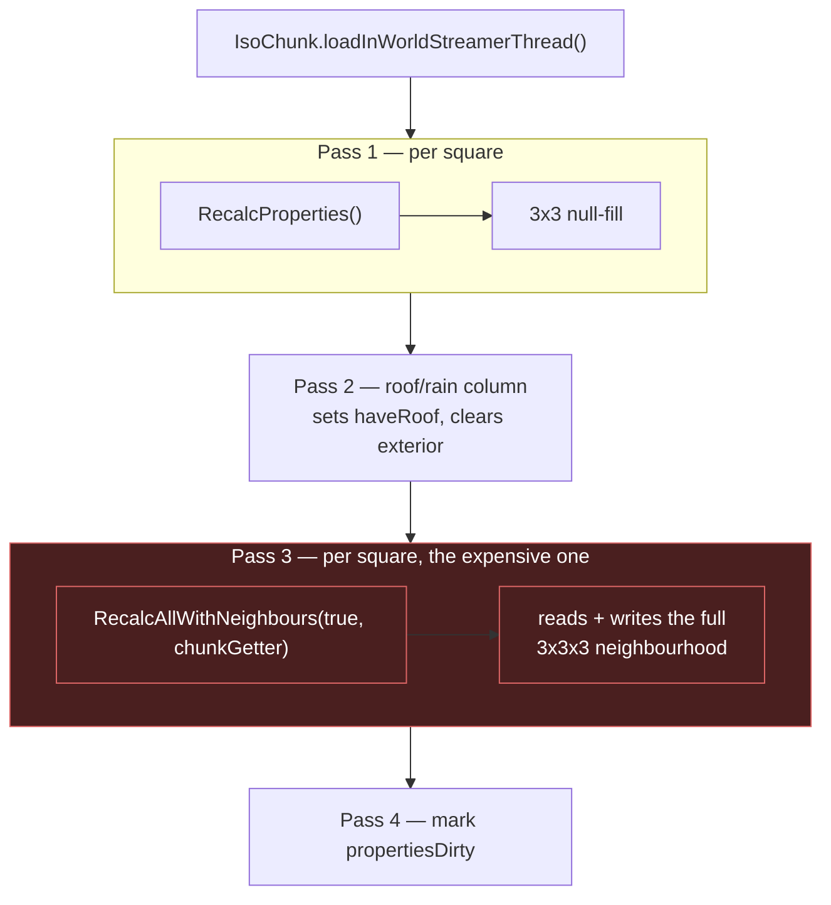

Grid size per chunk: **8 × 8 squares per level**, across `minLevel..maxLevel`.

Pass 3 reaching one tile *outside* the chunk is the fact that drives the entire
scheduling design in §5.

---

## 3. Why it can't already use more cores

Two independent blockers, both confirmed in the decompiled source:

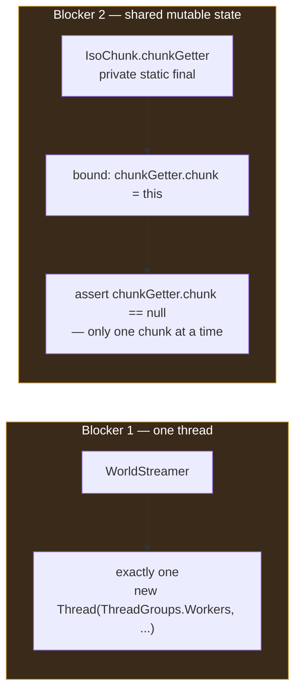

And one hazard found in the audit, on the same path:

> `IsoGridSquare.getNew(cell, slice, x, y, z)` polls a **static, non-thread-safe
> `ArrayDeque`** pool and writes static scratch (`col`, `path`, `pathdoor`,
> `vision`). `loadInWorldStreamerThread` calls it directly.

**The good news**, and the reason this is tractable at all — the arithmetic is
already clean. Every static reached by `ReCalculateAll`, `ReCalculateCollide`,
`ReCalculatePathFind` and `ReCalculateVisionBlocked` was enumerated, and there is
exactly one: `IsoGridSquare.setMatrixBit`, a pure bit function on an `int`.

---

## 4. The shape after the change

The streamer thread keeps the queue and the disk read. Only the grid pass moves.

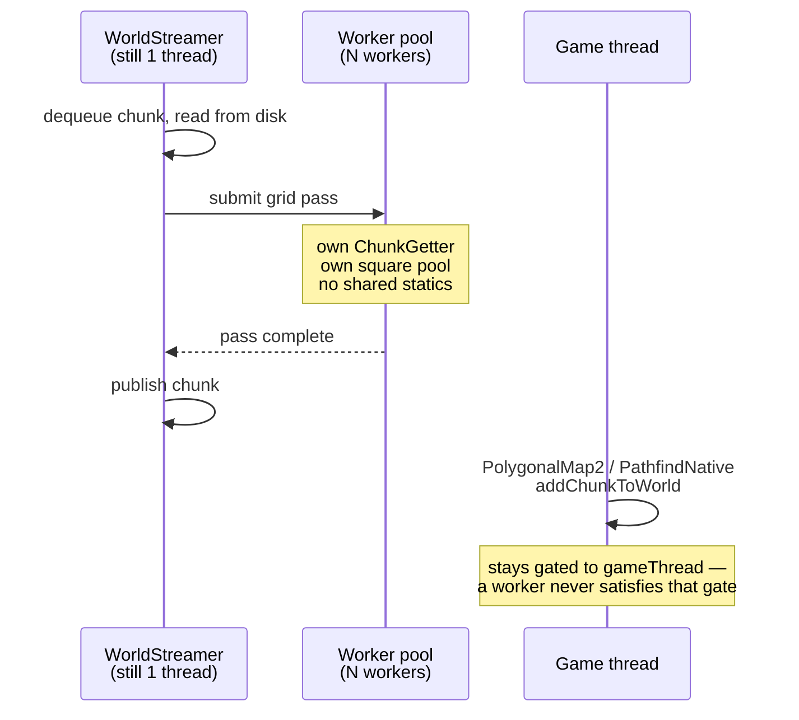

Same timeline as §1, with the pool:

```mermaid
gantt
    title With the pool — reads stay serial, recalcs overlap
    dateFormat X
    axisFormat %s
    section WorldStreamer
    read A    :done, 0, 1
    read B    :done, 1, 2
    read C    :done, 2, 3
    section Worker 1
    recalc A  :crit, 1, 4
    section Worker 2
    recalc B  :crit, 2, 5
    section Worker 3
    recalc C  :crit, 3, 6
```

**Why not widen `WorldStreamer` itself?** Its request lists (`chunkRequests1`,
`pendingRequests`, `jobList`) are plain `ArrayList`s mutated from its own thread.
Widening it means auditing and locking all of that — a large change to code that
isn't the bottleneck. The CPU-bound part is the grid pass.

---

## 5. The subtle part: ordering, not locking

Pass 3 writes into neighbouring chunks. Locking adjacent chunks would be *safe*,
but would leave their **order** up to the OS — and two orders can produce two
different worlds. The spec demands output that doesn't depend on scheduling.

So: chunks keep their queue order, and a chunk starts only when every
**earlier-queued adjacent** chunk has finished.

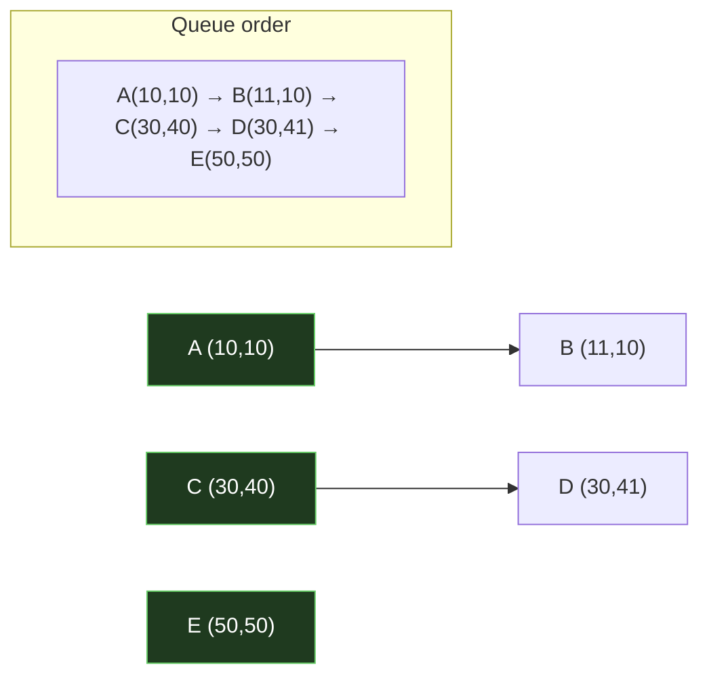

`A→B` and `C→D` are adjacency edges. `E` touches nothing.

```mermaid
gantt
    title Execution — green chunks start together, edges serialize the rest
    dateFormat X
    axisFormat %s
    section Worker 1
    A :crit, 0, 3
    B :active, 3, 6
    section Worker 2
    C :crit, 0, 3
    D :active, 3, 6
    section Worker 3
    E :crit, 0, 3
```

This is parallel execution of a **sequentially-ordered dependency graph**, so the
result is by construction the result the sequential pass would have produced.
Parity testing then confirms the reasoning rather than carrying it alone.

Adjacency means within one chunk in x or y — **and across levels**, since the
neighbourhood spans `z-1` to `z+1`.

---

## 6. How it ships

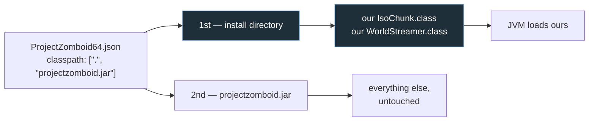

`.` is searched **before** the jar, so loose `.class` files shadow it. The jar is
never modified, its checksum stays intact, and uninstalling is deleting files.

Fallback if cfr's output won't recompile: a `-javaagent` rewriting bytecode at
load time. That's why proving the round-trip is task 1.

---

## 7. What we are deliberately not touching

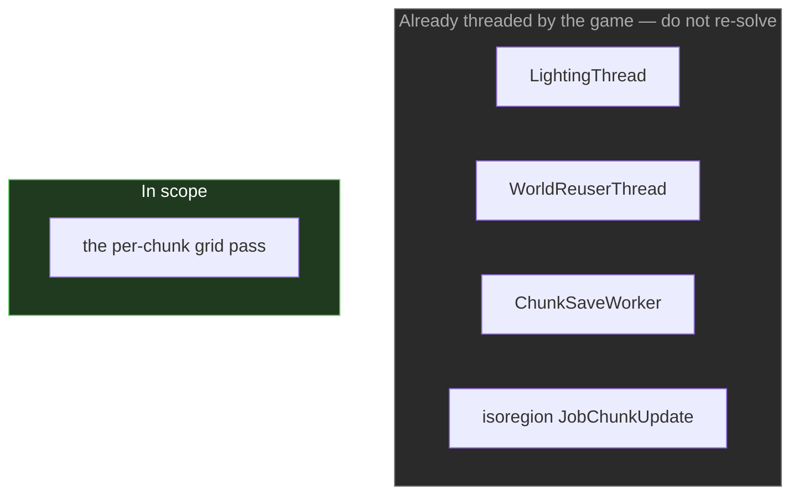

Also out: anything touching save format or network payloads, which keeps this
client-side and multiplayer-neutral.

---

## 8. Task order, and why it is this order

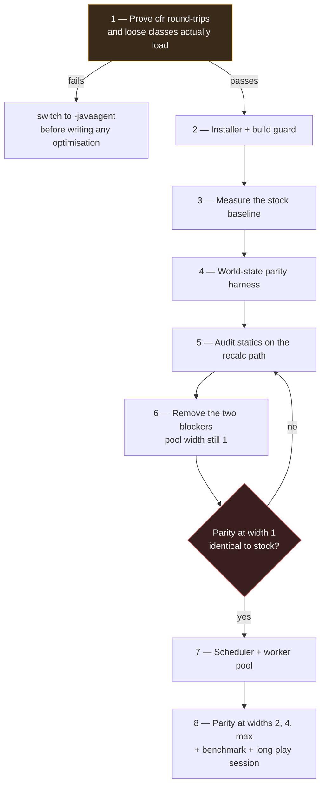

Three deliberate choices in that order:

| Choice | Reason |
|---|---|
| Delivery proven **first** | If `IsoChunk` won't round-trip, the whole mechanism changes. Better to know on day one than after the concurrency work. |
| Baseline measured **before** any behaviour change | You cannot claim a win you have no "before" for. |
| Blockers removed at **width 1**, parity checked, *then* the pool | Separates "did de-statication change anything?" from "did concurrency change anything?" — one variable at a time. |

---

## 9. Acceptance

The change is accepted only if **all three** hold:

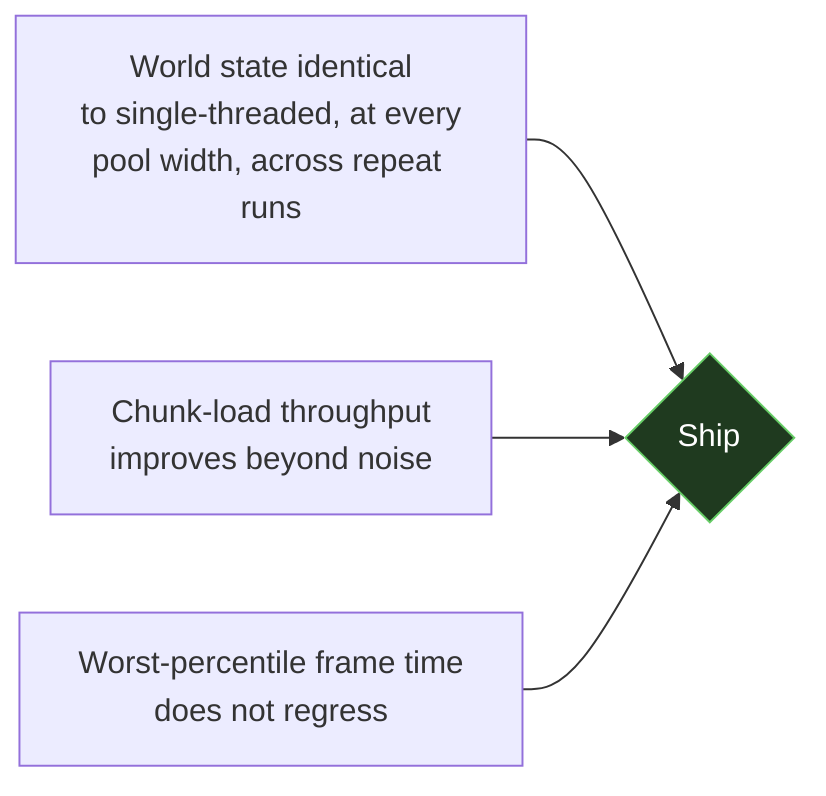

If the benchmark shows no win, the report says so plainly rather than dressing a
neutral result as a success. Whether the recalc or the disk read dominates chunk
load is still an open question — the instrumentation in task group 3 answers it.
